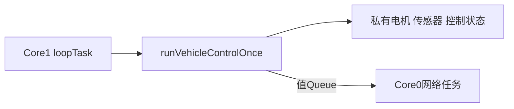
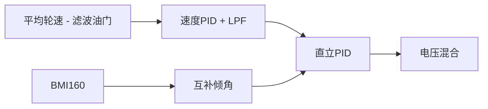
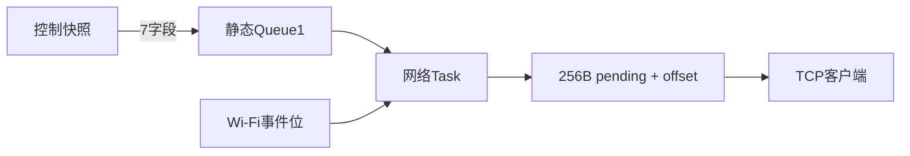
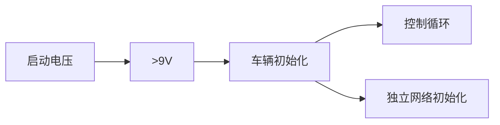
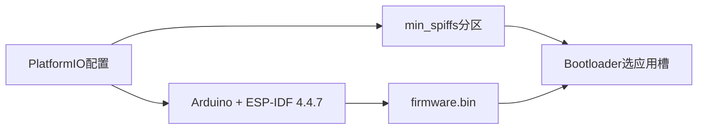

# 当前架构决策

> 模板只读：导入项目后，本文件应存放于 `docs/ADR-docs/templates/architecture-decisions.md`，禁止修改其中的任何内容。复制到 `docs/ADR-docs/architecture-decisions.md` 后，才可在项目文档副本中填写和维护当前项目情况；填写区以外的规范、字段和模板示例保持原样。详见项目中的 `docs/ADR-docs/templates/README.md`。

## 文档用途与维护要求

这份文档用于解释当前项目中重要架构选择的理由，帮助人和 AI 理解、修改并判断当前设计。

它重点回答：

- 当前采用什么方案，影响哪些范围？
- 为什么当前方案适合项目，有哪些取舍？
- 当前方案依赖哪些条件和约束？
- 有哪些代码、配置或测试依据，哪些结论尚未验证？
- 出现哪些可观察条件时，需要重新评估？

当前结构、功能入口和运行关系记录在 [`architecture.md`](./architecture.md)；本文件只记录当前有效的决策及其理由。

### 仅维护当前状态

- 每个架构主题只保留一份当前有效结论，不记录历史日志、旧方案、前后对比、迁移过程或已废弃决策。
- 决策发生变化时，直接重写对应主题的当前内容，并同步相关架构图、证据和链接；主题不再适用时，删除该主题及其失效引用。
- 取舍只解释当前方案的收益、代价和局限，不展开方案演化历史；尚未实施的方案不得描述为当前决策。
- 历史由版本控制系统保存，ADR 正文不维护时间线或版本快照。
- 证据不足时明确写“未知”或“未验证”，并关联 `architecture.md` 的 `Unknown / Unverified`；不得用推测补全设计理由。

### 组织方式与填写边界

以下规范和决策主题模板在项目中保持原样。项目文档副本仅在“项目真实决策”标记之后填写实际内容。

每个长期存在的架构问题使用二级标题 `## <决策主题>`，并保留模板中的全部字段及顺序。按实际主题重复条目；不适用项写明“不适用”及原因，不得删除字段或自行改造模板。

### 适合记录的决策

- 影响多个模块或长期维护方式的架构选择；
- 代码本身不足以解释的设计理由；
- 对当前方案至关重要的边界、约束和取舍；
- 可能因具体条件变化而需要重新评估的问题。

## 填写模板

### 决策主题模板

````markdown
## <决策主题>

**范围**

<受影响的功能、模块、接口或运行链路。>

**当前决策**

<当前实际采用的方案及关键边界。>

**为什么这样设计**

<当前方案满足哪些需求，关键收益、代价和局限是什么；理由未知时明确标注。>

**成立条件 / 约束**

- <当前依赖的资源、接口、所有权、并发、时序或平台约束。>

**需要重新评估的情况**

- <具体、可观察的触发条件；不是未来实施计划。>

**当前局部架构**


**当前架构位置**

- [`<对应功能或链路>`](./architecture.md#<anchor>)

**当前依据与验证边界**

- 依据：<当前源码路径与符号、配置、有效测试结果或外部约束来源。>
- 已核对：<证据直接支持的事实与范围；区分源码检查、编译、测试、仿真和硬件实测。>
- 未确认 / 未验证：<仍缺少的证据及验证方式；全部已确认时写“无”并说明核对范围。>
````

### “需要重新评估的情况”写法

尽量写成具体、可观察的触发条件，例如：

- 消费者数量超过 1 个；
- 数据需求变为每个样本都必须保存；
- 允许的端到端延迟小于当前已验证上限；
- 出现第二种硬件实现；
- 同步方式出现可测量的竞争或延迟；
- 外部接口或平台约束不再满足成立条件。

### 与 Architecture Change Gate 的关系

使用 [`architecture.md`](./architecture.md#architecture-change-gate) 中的只读检查清单判断是否需要更新项目文档副本。

架构策略、状态所有权、同步机制、模块职责、依赖关系背后的理由或关键约束变化时，以及命中重新评估条件时，核对并更新当前决策。不得追加历史记录，不得修改 `templates/` 中的文件。

---

<!-- 项目真实决策开始：仅在项目文档副本中，按上方模板添加当前有效的决策主题。 -->

## 单一控制所有者

**范围**

控制执行上下文、硬件对象、滤波/PID状态及跨核边界。

**当前决策**

Arduino loopTask在Core1调用唯一runVehicleControlOnce入口。该入口串行拥有双FOC、两路I2C、IMU、估计器和控制器；底层对象保存在模块私有作用域。网络在独立Core0任务执行，跨核只传值。没有独立ControlTask或固定周期控制调度。

**为什么这样设计**

共同使用总线和状态的计算由一个执行上下文完成，避免锁竞争与多方重复更新滤波器；独立网络任务隔离连接及格式化工作。代价是控制周期受整个同步链耗时影响，分核也不保证硬实时。

**成立条件 / 约束**

- 任一时刻只能有一个调用者运行控制入口。
- 网络任务不得调用I2C、FOC或读取latestTelemetry返回的共享引用。
- 任务启动/控制器初始化顺序必须满足静态资源生命周期。

**需要重新评估的情况**

- 需要第二个控制调用者或第二个I2C访问上下文。
- 实测控制周期抖动超过控制要求。
- 增加固定周期控制、ISR采样或多消费者。

**当前局部架构**



**当前架构位置**

- [对应功能或链路](./architecture.md#传感器到电机控制链路)

**当前依据与验证边界**

- 依据：[main.cpp](../../src/main.cpp)、[vehicle_control.cpp](../../src/vehicle_control.cpp)、[motor_foc_service.cpp](../../src/motor_foc_service.cpp)、[telemetry_runtime.cpp](../../src/telemetry_runtime.cpp)。
- 已核对：当前调用路径和Queue边界；当前源码完成PlatformIO ESP32构建。
- 未确认 / 未验证：实际周期、WCET和跨核干扰，见 [Unknown / Unverified](./architecture.md#6-unknown--unverified)。

## 原生蓝牙与命令快照

**范围**

Bluetooth资源保留、协议栈生命周期、BLE命令与控制之间的同步。

**当前决策**

btInUse以全局C链接强符号返回true。BLE使用ESP-IDF Controller/Bluedroid/GAP/GATTS，回调解析最多63字节ASCII并覆盖长度1静态RemoteCommand队列，控制侧零等待peek。断连只更新connected并恢复广播，保留最近油门和转向。

**为什么这样设计**

原生API明确资源归属；固定值Queue避免回调与控制链共享可变命令。最新命令语义允许中间输入被覆盖，不能用于完整输入事件记录。断连保持值是当前代码事实，不代表已验证为安全策略。

**成立条件 / 约束**

- 保留当前设备名、UUID、steering/throttle字段顺序和缩放。
- 回调不能访问电机、总线或执行阻塞网络工作。
- 当前BTDM配置不释放Classic BT内存，也不改写SDK配置。

**需要重新评估的情况**

- 操控端协议、字段范围或连接行为改变。
- 需要命令超时归零、失联停机或完整命令历史。
- 框架升级改变btInUse或Controller启动契约。

**当前局部架构**


**当前架构位置**

- [对应功能或链路](./architecture.md#蓝牙操控输入)

**当前依据与验证边界**

- 依据：[arduino_bt_startup.cpp](../../src/arduino_bt_startup.cpp)、[ble_idf_service.cpp](../../src/ble_idf_service.cpp)、[command_input.cpp](../../src/command_input.cpp)、[command_input_parser.cpp](../../src/command_input_parser.cpp)。
- 已核对：强符号和原生调用已由当前ELF/源码核对，命令Queue的复制路径已检查。
- 未确认 / 未验证：手机发现、GATT交互和Wi-Fi共存负载；见 [Unknown / Unverified](./architecture.md#6-unknown--unverified)。

## 姿态与控制计算边界

**范围**

IMU换算、互补滤波、速度外环和直立内环。

**当前决策**

BMI160 Y轴角速度与安装相关加速度角以0.98/0.02互补融合；dt来自millis采样差。控制器用方向统一的平均轮速减去滤波油门得到速度误差，速度PID及低通生成目标倾角增量；直立PID输入为1.8deg偏置加目标增量减实际倾角。转向为滤波电压差分量。

**为什么这样设计**

模块分离让姿态与控制的输入输出明确；状态对象持续保留滤波和PID历史。固定互补权重与当前可变调用周期共同决定滤波效果。当前算法参数选择的充分调参依据未知，不能由源码推断稳定性和精度。

**成立条件 / 约束**

- 100Hz为陀螺配置ODR，不是软件读取或控制频率保证。
- 当前倾角以deg参与控制，轮速为rad/s；目标增量不能直接当作含偏置的完整目标角。
- 数值valid不是总线事务状态，也未作为控制联锁。

**需要重新评估的情况**

- 更改IMU安装方向、ODR或估计器时基。
- 控制改为固定周期、替换滤波器或引入LQR。
- 独立参考测量显示姿态偏差或响应振荡超出要求。

**当前局部架构**



**当前架构位置**

- [对应功能或链路](./architecture.md#姿态估计)

**当前依据与验证边界**

- 依据：[attitude_system.cpp](../../src/attitude_system.cpp)、[vehicle_control.cpp](../../src/vehicle_control.cpp) 的VehicleController::update、[vehicle_config.h](../../include/vehicle_config.h)。
- 已核对：公式、单位、状态生命周期与当前配置；代码编译通过。
- 未确认 / 未验证：滤波精度、稳定性、硬件采样可靠性和调参效果，见 [Unknown / Unverified](./architecture.md#6-unknown--unverified)。

## 电机目标的周期语义

**范围**

双电机FOC、目标暂存和电压混合输出的含义。

**当前决策**

每轮先对左右电机loopFOC，再move消费先前目标；取得轮速后计算新控制量，stageTarget只写下一轮目标。电机采用MotionControlType::torque和TorqueControlType::voltage，混合左右目标为方向系数乘以平衡电压加/减转向电压。

**为什么这样设计**

明确计算和应用时刻，避免把遥测中的新目标误当成本轮已执行量。电压模式无需当前工程不存在的电流反馈，但目标不能等同实测电流或真实转矩。为何采用此具体控制相位的实验依据未知。

**成立条件 / 约束**

- 不在stageTarget中额外调用move。
- 两个电机各7极对数，供电配置12V、对齐电压2V。
- 速度PID输出限制6deg，平衡PID限制6V；混合器没有额外共同饱和。

**需要重新评估的情况**

- 更改目标应用相位或增设电流环。
- 电机/编码器方向、极对数或供电条件变化。
- 实测混合输出饱和或瞬态不满足要求。

**当前局部架构**


**当前架构位置**

- [对应功能或链路](./architecture.md#双电机foc与平衡控制)

**当前依据与验证边界**

- 依据：[motor_foc_service.cpp](../../src/motor_foc_service.cpp) 的initializeMotors/runFocAndReadWheelState/stageTarget及 [vehicle_control.cpp](../../src/vehicle_control.cpp)。
- 已核对：调用顺序、模式、目标混合与遥测来源；当前构建通过。
- 未确认 / 未验证：实机方向、FOC对齐、控制响应和饱和影响，见 [Unknown / Unverified](./architecture.md#6-unknown--unverified)。

## 遥测任务与最新值协议

**范围**

Wi-Fi STA、单客户端TCP、七字段协议和生产消费关系。

**当前决策**

Core0/P1静态网络任务每20ms读取长度1Queue；栈参数4096B。使用ESP-IDF 4.4.7原生esp_wifi/esp_event/esp_netif，固定WIFI_PS_MIN_MODEM，lwIP非阻塞socket监听3333。固定256B缓存按offset续传，连续EAGAIN约1秒断开。同连接不重复排入同时间戳，新连接发送协议头。仅发送时间、控制倾角、方向统一双轮速、左减右差值及左右目标电压。

**为什么这样设计**

最新值队列避免应用层无界积压；固定字节缓存保留部分帧完整性。代价是中间控制样本丢弃且TCP栈仍可能积压旧字节；不适合无损记录。原生网络接口避免将生命周期绑定到Arduino WiFi封装，控制仍使用现有Arduino框架。当前SDK在Wi-Fi/BLE共存时要求modem sleep；固定MIN_MODEM并移除关闭入口，防止无效省电配置在Wi-Fi内部任务中触发abort。省电/共存时隙可能增加网络时延，不能承诺固定端到端延迟。

**成立条件 / 约束**

- 网络独占socket、事件消费和CSV格式化，控制只非阻塞复制。
- 64位esp_timer时间来自控制周期起点，不是接收时间，也不表示硬件同步采样。
- STA凭据位于被忽略的本地头文件；无凭据或初始化失败只挂起网络任务。
- 重连退避1–10秒；初始化失败可能保留部分驱动资源至重启。
- Wi-Fi/BLE共享射频；必须保持WIFI_PS_MIN_MODEM，设置失败返回初始化失败。50Hz为配置而非测量保证。

**需要重新评估的情况**

- 客户端超过一个、字段超过缓存容量或需要完整样本历史。
- 严格端到端延迟、传感器有效性或丢样计数成为需求。
- 实测共存干扰、栈余量或堆占用不满足要求。

**当前局部架构**



**当前架构位置**

- [对应功能或链路](./architecture.md#wi-fi-tcp遥测)

**当前依据与验证边界**

- 依据：[telemetry_runtime.cpp](../../src/telemetry_runtime.cpp)、[telemetry_frame.h](../../include/telemetry_frame.h)、[wifi_station.cpp](../../src/wifi_station.cpp)、[tcp_telemetry.cpp](../../src/tcp_telemetry.cpp)、[协议说明](../wifi-telemetry.md)。
- 已核对：原生API边界、七字段映射、非阻塞socket和队列路径；目标板错误日志确认Wi-Fi/BLE共存要求modem sleep，回溯位于pm_set_sleep_type。当前固件PlatformIO编译链接成功。
- 未确认 / 未验证：修复后尚未烧录验证进入控制循环、联网、重连、慢客户端、共存或栈/堆余量；见 [Unknown / Unverified](./architecture.md#6-unknown--unverified)。

## 启动与故障边界

**范围**

启动电源门槛、各模块初始化失败及运行期安全状态。

**当前决策**

启动先等待ADC换算电压大于9V，再初始化串口、总线、BLE、IMU及电机。BLE失败记录日志，IMU初始化结果保存到快照；没有完整运行期安全状态机。网络启动不等IP，失败不阻塞后续控制。

**为什么这样设计**

网络是观测通道，其可用性不作为控制启动条件。启动门槛避免在低于设定电压时继续初始化，但不能替代持续欠压保护。现有安全处理范围有限，其足够性未知，不将缺失保护写成保证。

**成立条件 / 约束**

- bus_voltage_v仅表示启动读数，不能用于运行期电池压降分析。
- 无命令超时归零、持续欠压、倾倒或IMU故障自动停机联锁。
- 电压等待阶段发生在Serial.begin之前；不能保证该阶段日志可见。

**需要重新评估的情况**

- 增加运行期电压采样或任何运行期停机要求。
- 外设初始化失败必须阻止电机使能。
- 引入OTA或其他需要停止控制的维护动作。

**当前局部架构**



**当前架构位置**

- [对应功能或链路](./architecture.md#启动与电源检查)

**当前依据与验证边界**

- 依据：[vehicle_safety.cpp](../../src/vehicle_safety.cpp)、[vehicle_control.cpp](../../src/vehicle_control.cpp)、[main.cpp](../../src/main.cpp)。
- 已核对：启动顺序、阈值和失败处理分支；无完整安全状态机为源码事实。
- 未确认 / 未验证：ADC换算精度、低压及失联条件下目标板行为，见 [Unknown / Unverified](./architecture.md#6-unknown--unverified)。

## 平台与Flash分区

**范围**

构建工具链、SDK所有权和Flash布局。

**当前决策**

PlatformIO espressif32@6.10.0搭配Arduino-ESP32 2.0.17内含ESP-IDF 4.4.7；采用min_spiffs.csv：两个应用槽各1.875MiB，SPIFFS128KiB、coredump64KiB。NVS位于0x9000、otadata位于0xe000。应用没有OTA接收、写入、自检确认或升级服务。

**为什么这样设计**

当前固件大小需要足够应用分区；双槽布局容纳程序并保留另一应用槽。代价是文件系统空间较小。使用预编译SDK保持当前框架边界，不把应用功能开发扩展为内核配置改造。

**成立条件 / 约束**

- 板卡构建配置为4MiB Flash，单固件必须小于0x1E0000B。
- 不修改FreeRTOSConfig.h/sdkconfig或重定义CONFIG_FREERTOS。
- 只使用PlatformIO ESP32环境编译；当前工程没有文件系统业务。
- 分区预留不等于OTA已实现或回滚已验证。

**需要重新评估的情况**

- 固件超过应用槽、需要更多文件系统空间或更换Flash容量。
- 升级Arduino/ESP-IDF版本或明确要求重建SDK。
- 实现OTA或更改Bootloader/分区部署流程。

**当前局部架构**



**当前架构位置**

- [对应功能或链路](./architecture.md#构建与固件分区)

**当前依据与验证边界**

- 依据：[platformio.ini](../../platformio.ini)、当前安装框架tools/partitions/min_spiffs.csv及SDK版本头；[构建证据](../wifi-telemetry.md#分区和构建)。
- 已核对：当前PlatformIO编译链接成功：Flash1,509,933B、静态RAM63,380B；应用源码未包含OTA实现。
- 未确认 / 未验证：板上实际分区和启动、运行期资源与任何OTA恢复行为；见 [Unknown / Unverified](./architecture.md#6-unknown--unverified)。
