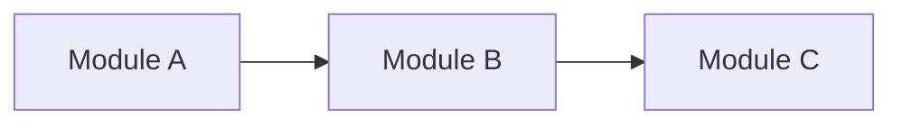
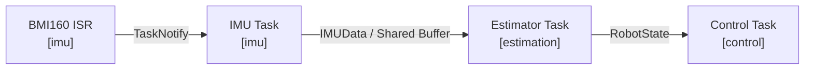
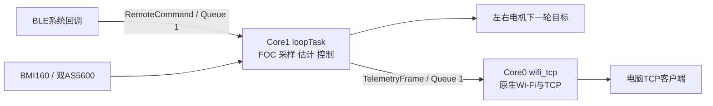
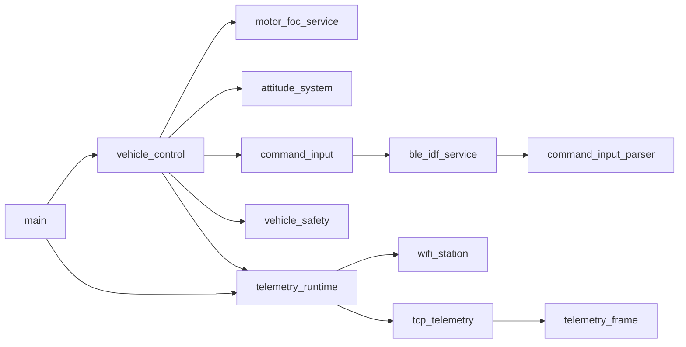
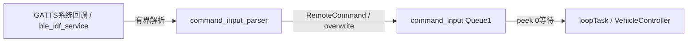
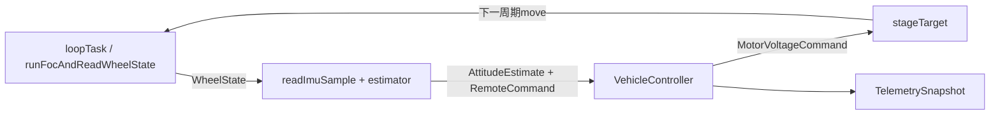
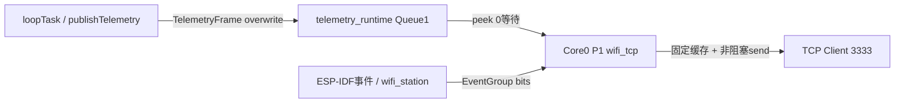

# 项目架构

> 模板只读：导入项目后，本文件应存放于 `docs/ADR-docs/templates/architecture.md`，禁止修改其中的任何内容。复制到 `docs/ADR-docs/architecture.md` 后，才可在项目文档副本中填写和维护当前项目情况；填写区以外的规范、字段和模板示例保持原样。详见项目中的 `docs/ADR-docs/templates/README.md`。

## 文档用途与维护要求

这份文档同时服务于人和 AI，用来建立并持续维护项目的当前心智模型。

它重点回答：

- 项目现在由哪些核心功能和模块组成？
- 一个功能运行时从哪里进入？
- 如果要理解或修改某个功能，应该从哪里开始读？
- 模块之间如何依赖？
- Task / ISR / Thread 等运行单元如何协作？
- 关键数据如何在模块和运行单元之间流动？
- 当前还有哪些关系尚未确认？

当前结构和运行关系记录在本文件中；当前有效的设计理由、约束和取舍记录在 [`architecture-decisions.md`](./architecture-decisions.md)。

### 仅维护当前状态

- 仅记录当前代码、配置和已核实运行方式；不记录变更日志、旧架构、迁移过程或已废弃方案。
- 项目变化时直接改写对应内容，删除失效描述，并同步修正相关图表、链接和决策；不追加历史快照。
- 未实现的方案不得写成当前事实；当前无法确认的关系记录到 `Unknown / Unverified`，确认后更新对应正文并移除已解决条目。
- 版本历史由版本控制系统保存，不在 ADR 正文中重复维护。

### 更新时机

当以下内容发生变化时，同步更新本文档：

- Feature 的职责或所属模块；
- Runtime Entry、Change Entry 或主要执行路径；
- 模块边界或依赖方向；
- Task / ISR / Thread / Worker 的职责或协作关系；
- 关键数据的生产者、消费者、传输方式或所有权；
- 常见修改的推荐阅读路径。

### Verification

项目文档副本的 Frontmatter 中，`verification` 用于说明当前内容的核对依据和范围，更新时覆盖原值，不追加核对历史：

- `status`：`verified` / `partial` / `unverified`
- `basis`：基于哪个工作区状态或 commit
- `scope`：核对了整个项目、改动区域还是某个子系统

`verified` 仅表示声明范围内的内容已由证据核对，不代表已完成编译、测试、仿真或硬件验证。源码核对与实测结论必须区分；未验证的行为、时序和指标放入 `Unknown / Unverified`。

---

## 填写模板

以下规范和条目模板在项目中保持原样。仅在项目文档副本中填写 Frontmatter 的 `verification` 值及“项目真实文档”区域；该区域必须保留六个章节及规定字段，按模板填写占位符、图表和条目。不适用项写明“不适用”及原因，不得删除字段或自行改造结构。

### Feature Navigation 条目模板

```markdown
### <功能名称>

**功能职责**

<这个功能负责什么，它的边界是什么。>

**所属模块**

`<module-or-package>`

**Runtime Entry**

`<symbol-or-path>`

<程序运行时，事件或执行流从哪里进入这个功能。>

**Change Entry**

`<symbol-or-path>`

<如果要理解或修改这个功能，最适合首先阅读的位置。>

**Main Path**

`<Entry>` → `<Core>` → `<State / Dependency>` → `<Output>`

**输入**

- `<input/event/data>`

**输出**

- `<output/event/data>`

**关键组件**

- `<path-or-symbol>` — <职责>
- `<path-or-symbol>` — <职责>

**相关架构决策**

- [`<Decision Topic>`](./architecture-decisions.md#<anchor>)

**已知约束**

- <约束>
```

其中：

- `Runtime Entry` 描述“程序从哪里进入这个功能”。
- `Change Entry` 描述“从哪里进入这段代码最容易理解和修改”。
- `Main Path` 描述最有代表性的主路径，通常保持在 3～6 个节点。
- `关键组件` 只列出理解该功能真正重要的代码位置。

### Change Guide 模板


| 我想修改…… | 从这里开始 | 推荐阅读路径 | 如何验证 | 相关 ADR |
| --- | --- | --- | --- | --- |
| `<功能 A>` | `<Change Entry>` | `<A → B → C>` | `<test/command>` | `<ADR topic / ->` |


### 静态模块结构模板

静态模块结构描述代码组织和长期依赖方向，回答“谁依赖谁”。


| 模块 | 主要职责 | 对外入口 / 接口 | 依赖 |
| --- | --- | --- | --- |
| `<module-a>` | `<responsibility>` | `<API/interface>` | `<module-b>` |




### 运行时链路模板

运行时链路把 **执行单元、数据、同步方式和模块** 放在同一条路径里描述，回答“系统实际怎么跑”。


### <链路名称>

**作用**

<这条链路完成什么。>

**主路径**



**运行单元**

| 运行单元 | 所属模块 | 触发 / 频率 | 职责 | 同步 / 通信 |
| --- | --- | --- | --- | --- |
| `<TaskA>` | `<module>` | `<1000 Hz / event>` | `<responsibility>` | `<Queue / Notify / Mutex>` |

**关键数据**

| 数据 | 生产者 | 消费者 | 所有权 / 生命周期 | 传输方式 |
| --- | --- | --- | --- | --- |
| `<DataType>` | `<producer>` | `<consumer>` | `<owner>` | `<Queue / Buffer / API>` |

### Unknown / Unverified 模板


| 状态 | 区域 | 问题 / 当前判断 | 还缺少什么信息 | 验证方式 |
| --- | --- | --- | --- | --- |
| `Unknown` | `<feature/module>` | `<question>` | `<missing information>` | `<files/tests/commands>` |
| `Unverified` | `<feature/module>` | `<hypothesis>` | `<missing evidence>` | `<verification path>` |
| `Suspected Drift` | `<feature/module>` | `<possible mismatch>` | `<evidence needed>` | `<verification path>` |


### Architecture Change Gate

完成较大的功能开发、重构或跨文件修改后，用下面的问题判断是否需要同步项目文档副本。此表是只读检查清单，不在模板或正文中逐次填写检查结果，也不积累 change 记录。

| 检查项 | 结果 |
| --- | --- |
| Feature 职责或归属是否变化？ | `<Yes/No/Unverified>` |
| 模块边界或依赖方向是否变化？ | `<Yes/No/Unverified>` |
| Runtime Entry、Change Entry 或 Main Path 是否变化？ | `<Yes/No/Unverified>` |
| Task / ISR / Thread / Worker 的关系是否变化？ | `<Yes/No/Unverified>` |
| 同步方式或状态所有权是否变化？ | `<Yes/No/Unverified>` |
| 关键数据流或数据契约是否变化？ | `<Yes/No/Unverified>` |
| 架构策略、约束或重要 trade-off 是否变化？ | `<Yes/No/Unverified>` |

对应动作：

- 当前结构、运行关系或数据流发生变化 → 更新 `architecture.md`
- 架构策略、约束或设计理由发生变化 → 更新 `architecture-decisions.md`
- 两类变化同时发生 → 同步更新两份文档
- 某项仍待确认 → 记录到 `Unknown / Unverified`
- 所有检查项均为 `No` → 本次无需更新架构文档

---

## 项目真实文档

### 1. 项目概览

`balancing_vehicle_work` 是Wemos LOLIN32 Lite双轮平衡车工程，包含原生BLE操控、BMI160互补姿态、双AS5600有感FOC、速度/直立控制及原生Wi-Fi TCP遥测。Arduino loopTask在Core1顺序拥有传感器和控制器；Core0独立网络任务通过长度1静态Queue消费七字段快照。没有独立ControlTask、固定周期控制调度或OTA升级服务。

当前工作树已经通过PlatformIO ESP32工具链编译链接；Flash为1,509,933 / 1,966,080 B，静态RAM为63,380 / 327,680 B。编译结果不代表烧录、实机控制或网络实时性验证。用户操作和协议说明见 [Wi-Fi遥测说明](../wifi-telemetry.md)。

#### 整体关系图



---

### 2. Feature Navigation Map

这一节按“功能”而不是按“目录”组织项目。

### 启动与电源检查

**功能职责**

初始化车辆外设、BLE和控制状态，再启动异步遥测；电源检查只覆盖启动阶段。

**所属模块**

`main / vehicle_control / vehicle_safety`

**Runtime Entry**

`setup()` → `initializeVehicle()`；框架先调用 `btInUse()`。

**Change Entry**

[vehicle_control.cpp](../../src/vehicle_control.cpp) 的 `initializeVehicle()`；电压门槛见 [vehicle_safety.cpp](../../src/vehicle_safety.cpp)。

**Main Path**

`setup` → `waitForStartupVoltage` → `外设与BLE初始化` → `initializeMotors` → `beginTelemetry`

**输入**

- ADC GPIO13电压、启动事件和编译期配置。

**输出**

- 外设初始化状态、控制对象就绪、静态网络任务。

**关键组件**

- `arduino_bt_startup.cpp::btInUse` — 保留BTDM资源。
- `vehicle_safety.cpp::waitForStartupVoltage` — 电压大于9V才退出，等待间隔100ms。
- `main.cpp::setup` — 初始化后创建遥测资源。

**相关架构决策**

- [启动与故障边界](./architecture-decisions.md#启动与故障边界)

**已知约束**

- 电压检查发生在Serial.begin之前；启动电压不会持续刷新。
- BLE/IMU初始化失败不构成完整电机联锁；无运行期欠压、倾倒或命令超时停机状态机。

### 蓝牙操控输入

**功能职责**

解析BLE写入命令，将最新转向电压与目标轮速交给控制链。

**所属模块**

`ble_idf_service / command_input / command_input_parser`

**Runtime Entry**

`gattsCallback()` → `handleCommandWrite()`；连接和断连事件也发布状态。

**Change Entry**

[command_input_parser.cpp](../../src/command_input_parser.cpp) 的 `parseRemoteCommand()`；生命周期见 [ble_idf_service.cpp](../../src/ble_idf_service.cpp)。

**Main Path**

`GATTS回调` → `parseRemoteCommand` → `RemoteCommand队列` → `latestRemoteCommand`

**输入**

- 最多63字节 `steering,throttle` ASCII和BLE连接事件。

**输出**

- `RemoteCommand`：目标轮速、转向电压、命令序号、接收毫秒与connected。

**关键组件**

- `beginCommandInput` — 创建长度1静态Queue。
- `beginBleIdfCommandService` — 原生Controller/Bluedroid/GAP/GATTS。

**相关架构决策**

- [原生蓝牙与命令快照](./architecture-decisions.md#原生蓝牙与命令快照)

**已知约束**

- 转向缩放为10×raw/1500，油门为10×raw/40；strtol前缀解析，不是严格范围校验。
- 断连保留最后命令；控制器未按connected或命令年龄拒绝输出。

### 姿态估计

**功能职责**

顺序读取BMI160并形成控制用互补滤波倾角。

**所属模块**

`attitude_system`

**Runtime Entry**

`runVehicleControlOnce()` → `readImuSample()` → `AttitudeEstimator::update()`。

**Change Entry**

[attitude_system.cpp](../../src/attitude_system.cpp)；量程和ODR见 [vehicle_config.h](../../include/vehicle_config.h)。

**Main Path**

`BMI160读取` → `ImuSample` → `互补滤波` → `AttitudeEstimate`

**输入**

- 三轴加速度、Y轴角速度、调用方millis采样时戳。

**输出**

- `pitch_deg`、俯仰角速度、interval_s和valid。

**关键组件**

- `initializeImu` — 陀螺校准、1000deg/s量程及100Hz配置。
- `AttitudeEstimator` — 保存融合角与前次采样时间。

**相关架构决策**

- [姿态与控制计算边界](./architecture-decisions.md#姿态与控制计算边界)

**已知约束**

- 0.98/0.02固定权重；加速度角使用安装相关公式。
- valid只检查数值有限性，不证明I2C事务成功；控制器不据此停机。
- 100Hz为陀螺ODR配置，不是控制循环实测频率。

### 双电机FOC与平衡控制

**功能职责**

读取轮速，执行速度外环、直立内环和差分电压混合，将目标暂存给下一轮。

**所属模块**

`motor_foc_service / vehicle_control`

**Runtime Entry**

`loop()` → `runVehicleControlOnce()`。

**Change Entry**

[vehicle_control.cpp](../../src/vehicle_control.cpp) 的 `VehicleController::update()`，随后读 [motor_foc_service.cpp](../../src/motor_foc_service.cpp)。

**Main Path**

`loopFOC与move` → `轮速及姿态` → `VehicleController` → `stageTarget`

**输入**

- 双轮轴速度、互补倾角与最新RemoteCommand。

**输出**

- `ControlOutput`及左右 `MotorVoltageCommand`。

**关键组件**

- `runFocAndReadWheelState` — 独占两套电机/传感器对象。
- `VehicleController` — PID、油门/转向/目标倾角滤波和混合器。

**相关架构决策**

- [电机目标的周期语义](./architecture-decisions.md#电机目标的周期语义)

**已知约束**

- 当前是电压转矩模式，未实现电流闭环或LQR。
- 两路I2C及控制器只有loopTask一个运行所有者，控制周期未固定。
- 平衡PID限制6V、速度PID限制6deg；混合器本身没有额外统一饱和。

### Wi-Fi TCP遥测

**功能职责**

将控制周期中的七个量作为最新状态发送给一个TCP客户端。

**所属模块**

`telemetry_runtime / telemetry_frame / wifi_station / tcp_telemetry`

**Runtime Entry**

`setup()` → `beginTelemetry()`；控制链末尾 `publishTelemetry()`，网络任务执行 `telemetryTask()`。

**Change Entry**

[telemetry_runtime.cpp](../../src/telemetry_runtime.cpp) 的字段映射，再读 [tcp_telemetry.cpp](../../src/tcp_telemetry.cpp) 的格式化与续传。

**Main Path**

`TelemetrySnapshot` → `TelemetryFrame队列` → `wifi_tcp任务` → `非阻塞TCP` → `电脑`

**输入**

- 本周期时间、倾角、轮速和混合后的目标电压；本地Wi-Fi凭据。

**输出**

- 3333端口两行协议头及七列LF结尾CSV。

**关键组件**

- `wifi_station` — 原生esp_wifi/esp_netif/esp_event、事件位与重连。
- `TcpTelemetryServer` — 256B固定缓存、部分发送、超时与去重。
- `telemetry_runtime` — 静态任务和Queue唯一所有者。

**相关架构决策**

- [遥测任务与最新值协议](./architecture-decisions.md#遥测任务与最新值协议)

**已知约束**

- Core0/P1/20ms，静态任务栈参数4096B；实际50Hz和栈余量未实测。
- 只有一份最新值，不保留全部控制周期；网络任务不能访问I2C或共享快照引用。
- Wi-Fi初始化失败后网络任务挂起至重启；驱动部分资源可能保留。

### 构建与固件分区

**功能职责**

定义ESP32目标、依赖版本和容纳固件的Flash布局。

**所属模块**

`platformio.ini / 框架分区表`

**Runtime Entry**

PlatformIO构建；Bootloader按分区表启动应用。

**Change Entry**

[platformio.ini](../../platformio.ini)。

**Main Path**

`PlatformIO` → `ESP32工具链` → `firmware.bin与分区表` → `Bootloader`

**输入**

- espressif32@6.10.0、Arduino框架、SimpleFOC 2.3.3、BMI160依赖。

**输出**

- lolin32_lite固件；min_spiffs.csv双OTA应用槽。

**关键组件**

- `board_build.partitions` — 每应用槽0x1E0000B。
- 框架ESP-IDF 4.4.7 — 提供FreeRTOS、原生网络和底层驱动。

**相关架构决策**

- [平台与Flash分区](./architecture-decisions.md#平台与flash分区)

**已知约束**

- 仅有OTA分区预留，应用没有OTA下载、写入或自检确认功能。
- 使用PlatformIO ESP32工具链；不修改预编译SDK配置。

---

### 3. Change Guide

| 我想修改…… | 从这里开始 | 推荐阅读路径 | 如何验证 | 相关 ADR |
| --- | --- | --- | --- | --- |
| 启动门槛和失败处理 | initializeVehicle | vehicle_safety → vehicle_control → main | 检查低压/初始化失败；台架启动测试 | [启动与故障边界](./architecture-decisions.md#启动与故障边界) |
| BLE协议和缩放 | parseRemoteCommand | command_input_parser → ble_idf_service → latestRemoteCommand | 长度/格式边界、实机连接/写入/断连 | [原生蓝牙与命令快照](./architecture-decisions.md#原生蓝牙与命令快照) |
| 倾角或PID | AttitudeEstimator::update / VehicleController::update | attitude_system → vehicle_config → vehicle_control | PlatformIO构建、外部倾角参考、受控响应 | [姿态与控制计算边界](./architecture-decisions.md#姿态与控制计算边界) |
| 电机方向或目标时序 | runFocAndReadWheelState | motor_foc_service → stageTarget → config | 架空轮方向检查和受控台架验证 | [电机目标的周期语义](./architecture-decisions.md#电机目标的周期语义) |
| 遥测字段和频率 | publishTelemetry | telemetry_frame → tcp_telemetry → vehicle_config | 构建、七列解析、断网/慢客户端和周期测量 | [遥测任务与最新值协议](./architecture-decisions.md#遥测任务与最新值协议) |
| 调度和跨核所有权 | runVehicleControlOnce / beginTelemetry | main → vehicle_control → telemetry_runtime | 单所有者检查、控制周期分布、栈/堆实测 | [单一控制所有者](./architecture-decisions.md#单一控制所有者) |
| 固件分区 | platformio.ini | 框架min_spiffs.csv → 构建尺寸 | PlatformIO构建与分区边界；实际部署另验 | [平台与Flash分区](./architecture-decisions.md#平台与flash分区) |

构建命令（仓库根目录、pwsh）：`& C:/Users/tgs27/.platformio/penv/Scripts/platformio.exe run -d balancing_vehicle_work -e lolin32_lite`。编译只验证源码与链接，实机共存和控制行为需独立验证。

---

### 4. 静态模块结构

这一节描述长期稳定的模块边界和依赖方向。

它关注的是“代码结构上的依赖”，而不是运行时数据如何流动。

#### 模块职责

| 模块 | 主要职责 | 对外入口 / 接口 | 依赖 |
| --- | --- | --- | --- |
| main | 启动和loop入口 | setup / loop | vehicle_control、telemetry_runtime |
| arduino_bt_startup | 保留BTDM内存 | C链接强符号btInUse | Arduino启动契约 |
| vehicle_config / app_types | 参数和内部值契约 | constexpr / 固定结构体 | 标准整数类型 |
| vehicle_control | 控制链、PID对象、完整快照 | initializeVehicle / runVehicleControlOnce / latestTelemetry | 电机、姿态、命令、安全、遥测 |
| motor_foc_service | 两套私有电机、驱动、AS5600 | initializePinsAndEncoders / initializeMotors / runFocAndReadWheelState / stageTarget | SimpleFOC、Wire、config |
| attitude_system | BMI160与互补滤波 | initializeImu / readImuSample / AttitudeEstimator | BMI160、Wire、config |
| vehicle_safety | 启动电压门槛 | waitForStartupVoltage | Arduino ADC、config |
| command_input / command_input_parser | 命令Queue和解析 | beginCommandInput / latestRemoteCommand / parseRemoteCommand | FreeRTOS Queue、app_types、BLE适配 |
| ble_idf_service | BLE协议栈与GATT生命周期 | beginBleIdfCommandService / bleIdfCommandServiceState | ESP-IDF Bluetooth、Queue、解析器 |
| telemetry_runtime / telemetry_frame | 七字段映射与静态任务/队列 | beginTelemetry / publishTelemetry | app_types、config、FreeRTOS、网络模块 |
| wifi_station | STA连接、事件与退避 | beginWifiStation / pollWifiStation / wifiStationHasIpAddress / getWifiStationIpAddress | esp_wifi、esp_event、esp_netif、EventGroup |
| tcp_telemetry | CSV、socket、续传与去重 | TcpTelemetryServer::update / publish | telemetry_frame、lwIP、ESP日志 |

#### 模块依赖图



#### 关键依赖规则

- Wire（SDA19/SCL18）由左AS5600与BMI160共享；Wire1（SDA23/SCL5）对应右AS5600；均由控制入口串行访问，400kHz。
- 底层电机和传感器对象不对外暴露；网络任务只能消费复制后的TelemetryFrame，不能访问latestTelemetry的引用。
- BLE回调只做有界解析及Queue更新，不读I2C、不执行控制算法；实时控制不执行socket或CSV格式化。
- 网络模块不依赖Arduino WiFi、WiFiClient、Serial或millis；控制与硬件层仍使用Arduino及SimpleFOC。
- Wi-Fi模块固定调用esp_wifi_set_ps(WIFI_PS_MIN_MODEM)，不提供关闭modem sleep的配置入口；当前SDK的Wi-Fi/BLE共存要求此约束。
- beginTelemetry在唯一控制循环开始前调用；后续若改变执行位置，必须保持控制入口单一调用者。此约束不是已实现ControlTask。

---

### 5. 运行时链路与数据流

这一节统一描述当前任务关系和数据流。

阅读顺序建议是：

> **先看一条完整链路 → 再看其中有哪些运行单元 → 最后看关键数据如何传输。**

每一条核心链路都应同时体现：

- 所属模块；
- Task / ISR / Thread 等运行单元；
- 触发或调度关系；
- 数据类型；
- Queue / Notification / Buffer / API 等通信方式；
- 最终输出。

#### 启动链路

**作用**

框架保留BTDM资源；车辆完成启动电压、总线、BLE、IMU及电机初始化，然后启动网络任务。网络获得IP不是进入loop的条件。

**主路径**


**运行单元**

| 运行单元 | 所属模块 | 触发 / 频率 | 职责 | 同步 / 通信 |
| --- | --- | --- | --- | --- |
| Arduino loopTask | main / vehicle_control | 启动一次 | 初始化硬件和静态资源 | 顺序函数调用 |
| wifi_tcp Core0/P1 | telemetry_runtime | 任务创建后 | 初始化原生Wi-Fi | EventGroup；失败永久挂起 |

**关键数据**

| 数据 | 生产者 | 消费者 | 所有权 / 生命周期 | 传输方式 |
| --- | --- | --- | --- | --- |
| startup_bus_voltage_v / imu_ready | 初始化函数 | 控制快照 | vehicle_control静态生命周期 | 值保存，非运行期联锁 |
| task_handle / telemetry_queue | beginTelemetry | 控制发布和网络任务 | telemetry_runtime静态生命周期 | Task/Queue句柄 |

#### 蓝牙命令链路

**作用**

把BLE系统上下文的命令传入控制循环，不跨上下文共享普通可变结构体。

**主路径**



**运行单元**

| 运行单元 | 所属模块 | 触发 / 频率 | 职责 | 同步 / 通信 |
| --- | --- | --- | --- | --- |
| BLE系统回调 | ble_idf_service | 写入、连接、断连事件 | 解析/更新时间和连接状态 | xQueueOverwrite |
| loopTask Core1 | vehicle_control | 每控制周期 | 读取最新命令 | xQueuePeek(...,0) |

**关键数据**

| 数据 | 生产者 | 消费者 | 所有权 / 生命周期 | 传输方式 |
| --- | --- | --- | --- | --- |
| RemoteCommand | BLE回调 | latestRemoteCommand / controller | producer副本与Queue存储长期存在；消费者为局部值 | 长度1静态Queue；中间命令可覆盖 |

#### 传感器到电机控制链路

**作用**

单一loopTask依次执行双FOC、消费上一轮目标、取得轮速与姿态、计算并暂存下一轮目标。没有应用ISR或独立采样Task。

**主路径**



**运行单元**

| 运行单元 | 所属模块 | 触发 / 频率 | 职责 | 同步 / 通信 |
| --- | --- | --- | --- | --- |
| loopTask Core1 | vehicle_control / motor_foc_service / attitude_system | 无固定周期，持续loop | I2C、FOC、滤波和PID唯一运行所有者 | 同步函数和值类型 |

**关键数据**

| 数据 | 生产者 | 消费者 | 所有权 / 生命周期 | 传输方式 |
| --- | --- | --- | --- | --- |
| WheelState / ImuSample / AttitudeEstimate | FOC及IMU/估计模块 | controller和快照 | 本周期局部值；滤波/电机状态私有静态 | 函数返回/const引用 |
| MotorVoltageCommand | VehicleController | stageTarget及下一轮move | 电机对象保存下一目标 | 同步赋值 |
| TelemetrySnapshot | runVehicleControlOnce | publishTelemetry | vehicle_control静态缓存；不允许跨核直接读引用 | 同上下文const引用后复制七字段 |

#### 控制快照到TCP链路

**作用**

网络任务以20ms节拍观察最新快照，维护STA重连及单客户端TCP输出。

**主路径**



**运行单元**

| 运行单元 | 所属模块 | 触发 / 频率 | 职责 | 同步 / 通信 |
| --- | --- | --- | --- | --- |
| loopTask Core1 | vehicle_control / telemetry_runtime | 每控制周期末尾 | 映射并复制7字段 | xQueueOverwrite |
| wifi_tcp Core0/P1，栈4096B | telemetry_runtime | vTaskDelayUntil，20ms；超期重置节拍 | Wi-Fi轮询、格式化、TCP续传 | Queue peek、socket MSG_DONTWAIT |
| Wi-Fi/IP事件回调 | wifi_station / ESP-IDF事件任务 | start/disconnect/got-IP | 更新连接事件位 | 静态EventGroup |
| Wi-Fi驱动/lwIP任务 | ESP-IDF | 框架事件驱动 | 射频及TCP/IP协议栈 | SDK内部机制，应用不直接调度 |

**关键数据**

| 数据 | 生产者 | 消费者 | 所有权 / 生命周期 | 传输方式 |
| --- | --- | --- | --- | --- |
| TelemetryFrame | publishTelemetry | TcpTelemetryServer | Queue单槽与网络局部副本；无指针所有权转移 | 7字段按值复制 |
| Wi-Fi事件位 | ESP-IDF回调 | pollWifiStation | wifi_station静态EventGroup | bits |
| CSV pendingBuffer | TcpTelemetryServer | 非阻塞send | 网络任务私有256B缓存，保存offset/length | 部分发送续传，完成后复用 |

七列顺序：`time_s,pitch_deg,left_velocity_rad_s,right_velocity_rad_s,velocity_difference_rad_s,left_target_v,right_target_v`。时间来自控制周期起点的64位esp_timer_get_time，输出秒及6位小数；左右轮速乘控制方向系数，差值为左减右；电压为下一周期目标，不是实测电压。协议头为 `#balancing_vehicle_tcp,v1` 和字段行；LF分帧，接收方必须处理粘包与拆包。

---

### 6. Unknown / Unverified

| 状态 | 区域 | 问题 / 当前判断 | 还缺少什么信息 | 验证方式 |
| --- | --- | --- | --- | --- |
| Unverified | 控制实时性 | loop无固定周期；跨核不能证明实时隔离 | 周期P50/P99/max、执行时间及网络影响 | BLE/Wi-Fi并发负载下目标板计时 |
| Unverified | 网络协议 | 非阻塞续传/超时仅有源码和构建证据 | 真机收发、断网重连、慢客户端记录 | TCP客户端按LF接收、暂停读取和重连 |
| Unverified | 栈与堆 | 网络静态栈4096B，SDK有内部分配 | 栈high-water和最小空闲堆 | 目标板峰值负载测量 |
| Unverified | BLE兼容及共存 | 原生GATT与Wi-Fi同时存在；modem sleep固定开启 | 修复后正常进入控制、手机交互及命令更新时间 | 现有操控端连接，比较开启/关闭遥测 |
| Unverified | 姿态和硬件 | 数值valid不证明I2C成功，传感器顺序采样 | I2C错误、角度真值、方向和安装一致性 | 外部角度参考、总线记录、受控台架 |
| Unverified | 故障行为 | 无完整运行期安全联锁；断连保留命令是已知事实 | 失联/低压/传感器失效条件下的目标板结果 | 架空或系留状态验证，禁止用仿真替代实机结论 |
| Unverified | Flash部署 | 构建使用min_spiffs；无OTA服务是已知事实 | 设备实际分区和启动验证 | 授权后串口部署并核对分区；当前未烧录 |
