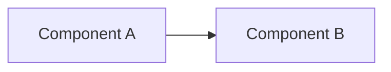

# 当前架构决策

> 模板只读：导入项目后，本文件应存放于 `docs/ADR-docs/templates/architecture-decisions.md`，禁止修改其中的任何内容。复制到 `docs/ADR-docs/architecture-decisions.md` 后，才可在项目文档副本中填写和维护当前项目情况；填写区以外的规范、字段和模板示例保持原样。详见项目中的 `docs/ADR-docs/templates/README.md`。

## 文档用途与维护要求

这份文档用于解释当前项目中重要架构选择的理由，帮助人和 AI 理解、修改并判断当前设计。

它重点回答：

- 当前采用什么方案，影响哪些范围？
- 为什么当前方案适合项目，有哪些取舍？
- 当前方案依赖哪些条件和约束？
- 有哪些代码、配置或测试依据，哪些结论尚未验证？
- 出现哪些可观察条件时，需要重新评估？

当前结构、功能入口和运行关系记录在 [`architecture.md`](./architecture.md)；本文件只记录当前有效的决策及其理由。

### 仅维护当前状态

- 每个架构主题只保留一份当前有效结论，不记录历史日志、旧方案、前后对比、迁移过程或已废弃决策。
- 决策发生变化时，直接重写对应主题的当前内容，并同步相关架构图、证据和链接；主题不再适用时，删除该主题及其失效引用。
- 取舍只解释当前方案的收益、代价和局限，不展开方案演化历史；尚未实施的方案不得描述为当前决策。
- 历史由版本控制系统保存，ADR 正文不维护时间线或版本快照。
- 证据不足时明确写“未知”或“未验证”，并关联 `architecture.md` 的 `Unknown / Unverified`；不得用推测补全设计理由。

### 组织方式与填写边界

以下规范和决策主题模板在项目中保持原样。项目文档副本仅在“项目真实决策”标记之后填写实际内容。

每个长期存在的架构问题使用二级标题 `## <决策主题>`，并保留模板中的全部字段及顺序。按实际主题重复条目；不适用项写明“不适用”及原因，不得删除字段或自行改造模板。

### 适合记录的决策

- 影响多个模块或长期维护方式的架构选择；
- 代码本身不足以解释的设计理由；
- 对当前方案至关重要的边界、约束和取舍；
- 可能因具体条件变化而需要重新评估的问题。

## 填写模板

### 决策主题模板

````markdown
## <决策主题>

**范围**

<受影响的功能、模块、接口或运行链路。>

**当前决策**

<当前实际采用的方案及关键边界。>

**为什么这样设计**

<当前方案满足哪些需求，关键收益、代价和局限是什么；理由未知时明确标注。>

**成立条件 / 约束**

- <当前依赖的资源、接口、所有权、并发、时序或平台约束。>

**需要重新评估的情况**

- <具体、可观察的触发条件；不是未来实施计划。>

**当前局部架构**



**当前架构位置**

- [`<对应功能或链路>`](./architecture.md#<anchor>)

**当前依据与验证边界**

- 依据：<当前源码路径与符号、配置、有效测试结果或外部约束来源。>
- 已核对：<证据直接支持的事实与范围；区分源码检查、编译、测试、仿真和硬件实测。>
- 未确认 / 未验证：<仍缺少的证据及验证方式；全部已确认时写“无”并说明核对范围。>
````

### “需要重新评估的情况”写法

尽量写成具体、可观察的触发条件，例如：

- 消费者数量超过 1 个；
- 数据需求变为每个样本都必须保存；
- 允许的端到端延迟小于当前已验证上限；
- 出现第二种硬件实现；
- 同步方式出现可测量的竞争或延迟；
- 外部接口或平台约束不再满足成立条件。

### 与 Architecture Change Gate 的关系

使用 [`architecture.md`](./architecture.md#architecture-change-gate) 中的只读检查清单判断是否需要更新项目文档副本。

架构策略、状态所有权、同步机制、模块职责、依赖关系背后的理由或关键约束变化时，以及命中重新评估条件时，核对并更新当前决策。不得追加历史记录，不得修改 `templates/` 中的文件。

---

<!-- 项目真实决策开始：仅在项目文档副本中，按上方模板添加当前有效的决策主题。 -->
