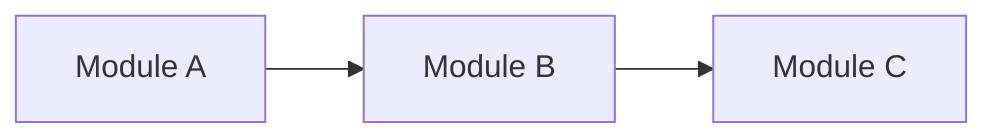
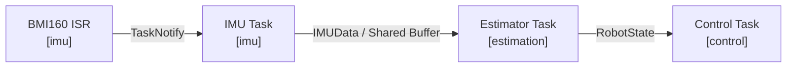
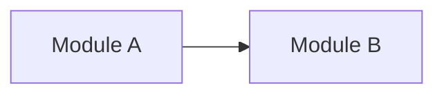
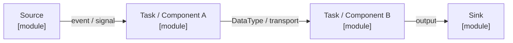

# 项目架构

> 模板只读：导入项目后，本文件应存放于 `docs/ADR-docs/templates/architecture.md`，禁止修改其中的任何内容。复制到 `docs/ADR-docs/architecture.md` 后，才可在项目文档副本中填写和维护当前项目情况；填写区以外的规范、字段和模板示例保持原样。详见项目中的 `docs/ADR-docs/templates/README.md`。

## 文档用途与维护要求

这份文档同时服务于人和 AI，用来建立并持续维护项目的当前心智模型。

它重点回答：

- 项目现在由哪些核心功能和模块组成？
- 一个功能运行时从哪里进入？
- 如果要理解或修改某个功能，应该从哪里开始读？
- 模块之间如何依赖？
- Task / ISR / Thread 等运行单元如何协作？
- 关键数据如何在模块和运行单元之间流动？
- 当前还有哪些关系尚未确认？

当前结构和运行关系记录在本文件中；当前有效的设计理由、约束和取舍记录在 [`architecture-decisions.md`](./architecture-decisions.md)。

### 仅维护当前状态

- 仅记录当前代码、配置和已核实运行方式；不记录变更日志、旧架构、迁移过程或已废弃方案。
- 项目变化时直接改写对应内容，删除失效描述，并同步修正相关图表、链接和决策；不追加历史快照。
- 未实现的方案不得写成当前事实；当前无法确认的关系记录到 `Unknown / Unverified`，确认后更新对应正文并移除已解决条目。
- 版本历史由版本控制系统保存，不在 ADR 正文中重复维护。

### 更新时机

当以下内容发生变化时，同步更新本文档：

- Feature 的职责或所属模块；
- Runtime Entry、Change Entry 或主要执行路径；
- 模块边界或依赖方向；
- Task / ISR / Thread / Worker 的职责或协作关系；
- 关键数据的生产者、消费者、传输方式或所有权；
- 常见修改的推荐阅读路径。

### Verification

项目文档副本的 Frontmatter 中，`verification` 用于说明当前内容的核对依据和范围，更新时覆盖原值，不追加核对历史：

- `status`：`verified` / `partial` / `unverified`
- `basis`：基于哪个工作区状态或 commit
- `scope`：核对了整个项目、改动区域还是某个子系统

`verified` 仅表示声明范围内的内容已由证据核对，不代表已完成编译、测试、仿真或硬件验证。源码核对与实测结论必须区分；未验证的行为、时序和指标放入 `Unknown / Unverified`。

---

## 填写模板

以下规范和条目模板在项目中保持原样。仅在项目文档副本中填写 Frontmatter 的 `verification` 值及“项目真实文档”区域；该区域必须保留六个章节及规定字段，按模板填写占位符、图表和条目。不适用项写明“不适用”及原因，不得删除字段或自行改造结构。

### Feature Navigation 条目模板

```markdown
### <功能名称>

**功能职责**

<这个功能负责什么，它的边界是什么。>

**所属模块**

`<module-or-package>`

**Runtime Entry**

`<symbol-or-path>`

<程序运行时，事件或执行流从哪里进入这个功能。>

**Change Entry**

`<symbol-or-path>`

<如果要理解或修改这个功能，最适合首先阅读的位置。>

**Main Path**

`<Entry>` → `<Core>` → `<State / Dependency>` → `<Output>`

**输入**

- `<input/event/data>`

**输出**

- `<output/event/data>`

**关键组件**

- `<path-or-symbol>` — <职责>
- `<path-or-symbol>` — <职责>

**相关架构决策**

- [`<Decision Topic>`](./architecture-decisions.md#<anchor>)

**已知约束**

- <约束>
```

其中：

- `Runtime Entry` 描述“程序从哪里进入这个功能”。
- `Change Entry` 描述“从哪里进入这段代码最容易理解和修改”。
- `Main Path` 描述最有代表性的主路径，通常保持在 3～6 个节点。
- `关键组件` 只列出理解该功能真正重要的代码位置。

### Change Guide 模板


| 我想修改…… | 从这里开始 | 推荐阅读路径 | 如何验证 | 相关 ADR |
| --- | --- | --- | --- | --- |
| `<功能 A>` | `<Change Entry>` | `<A → B → C>` | `<test/command>` | `<ADR topic / ->` |


### 静态模块结构模板

静态模块结构描述代码组织和长期依赖方向，回答“谁依赖谁”。


| 模块 | 主要职责 | 对外入口 / 接口 | 依赖 |
| --- | --- | --- | --- |
| `<module-a>` | `<responsibility>` | `<API/interface>` | `<module-b>` |




### 运行时链路模板

运行时链路把 **执行单元、数据、同步方式和模块** 放在同一条路径里描述，回答“系统实际怎么跑”。


### <链路名称>

**作用**

<这条链路完成什么。>

**主路径**



**运行单元**

| 运行单元 | 所属模块 | 触发 / 频率 | 职责 | 同步 / 通信 |
| --- | --- | --- | --- | --- |
| `<TaskA>` | `<module>` | `<1000 Hz / event>` | `<responsibility>` | `<Queue / Notify / Mutex>` |

**关键数据**

| 数据 | 生产者 | 消费者 | 所有权 / 生命周期 | 传输方式 |
| --- | --- | --- | --- | --- |
| `<DataType>` | `<producer>` | `<consumer>` | `<owner>` | `<Queue / Buffer / API>` |

### Unknown / Unverified 模板


| 状态 | 区域 | 问题 / 当前判断 | 还缺少什么信息 | 验证方式 |
| --- | --- | --- | --- | --- |
| `Unknown` | `<feature/module>` | `<question>` | `<missing information>` | `<files/tests/commands>` |
| `Unverified` | `<feature/module>` | `<hypothesis>` | `<missing evidence>` | `<verification path>` |
| `Suspected Drift` | `<feature/module>` | `<possible mismatch>` | `<evidence needed>` | `<verification path>` |


### Architecture Change Gate

完成较大的功能开发、重构或跨文件修改后，用下面的问题判断是否需要同步项目文档副本。此表是只读检查清单，不在模板或正文中逐次填写检查结果，也不积累 change 记录。

| 检查项 | 结果 |
| --- | --- |
| Feature 职责或归属是否变化？ | `<Yes/No/Unverified>` |
| 模块边界或依赖方向是否变化？ | `<Yes/No/Unverified>` |
| Runtime Entry、Change Entry 或 Main Path 是否变化？ | `<Yes/No/Unverified>` |
| Task / ISR / Thread / Worker 的关系是否变化？ | `<Yes/No/Unverified>` |
| 同步方式或状态所有权是否变化？ | `<Yes/No/Unverified>` |
| 关键数据流或数据契约是否变化？ | `<Yes/No/Unverified>` |
| 架构策略、约束或重要 trade-off 是否变化？ | `<Yes/No/Unverified>` |

对应动作：

- 当前结构、运行关系或数据流发生变化 → 更新 `architecture.md`
- 架构策略、约束或设计理由发生变化 → 更新 `architecture-decisions.md`
- 两类变化同时发生 → 同步更新两份文档
- 某项仍待确认 → 记录到 `Unknown / Unverified`
- 所有检查项均为 `No` → 本次无需更新架构文档

---

## 项目真实文档

### 1. 项目概览

<用简洁自然语言描述当前项目的目的、主要子系统，以及系统最核心的运行方式。>

#### 整体关系图


---

### 2. Feature Navigation Map

这一节按“功能”而不是按“目录”组织项目。

<!-- 从这里开始添加真实 Feature。 -->

---

### 3. Change Guide

| 我想修改…… | 从这里开始 | 推荐阅读路径 | 如何验证 | 相关 ADR |
| --- | --- | --- | --- | --- |
|  |  |  |  |  |

---

### 4. 静态模块结构

这一节描述长期稳定的模块边界和依赖方向。

它关注的是“代码结构上的依赖”，而不是运行时数据如何流动。

#### 模块职责

| 模块 | 主要职责 | 对外入口 / 接口 | 依赖 |
| --- | --- | --- | --- |
|  |  |  |  |

#### 模块依赖图



#### 关键依赖规则

- 

---

### 5. 运行时链路与数据流

这一节统一描述当前任务关系和数据流。

阅读顺序建议是：

> **先看一条完整链路 → 再看其中有哪些运行单元 → 最后看关键数据如何传输。**

每一条核心链路都应同时体现：

- 所属模块；
- Task / ISR / Thread 等运行单元；
- 触发或调度关系；
- 数据类型；
- Queue / Notification / Buffer / API 等通信方式；
- 最终输出。

#### <核心链路名称>

**作用**

<这条链路完成什么。>

**主路径**



**运行单元**

| 运行单元 | 所属模块 | 触发 / 频率 | 职责 | 同步 / 通信 |
| --- | --- | --- | --- | --- |
|  |  |  |  |  |

**关键数据**

| 数据 | 生产者 | 消费者 | 所有权 / 生命周期 | 传输方式 |
| --- | --- | --- | --- | --- |
|  |  |  |  |  |

<!-- 按重要链路继续添加，例如 Sensor → Estimator → Control、Request → Service → DB 等。 -->

---

### 6. Unknown / Unverified

| 状态 | 区域 | 问题 / 当前判断 | 还缺少什么信息 | 验证方式 |
| --- | --- | --- | --- | --- |
|  |  |  |  |  |
