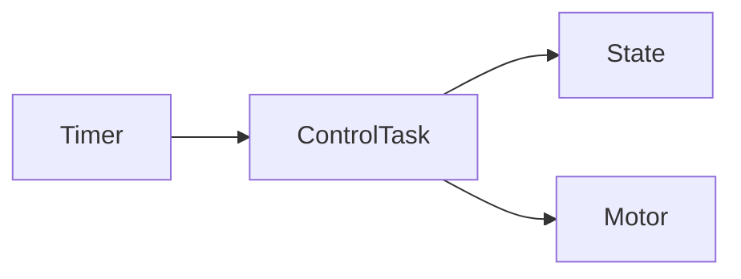
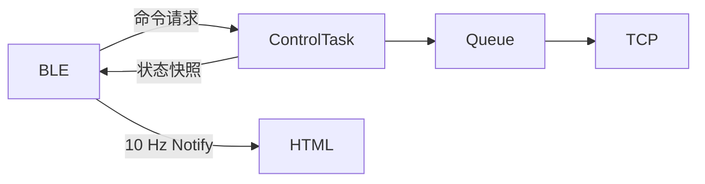
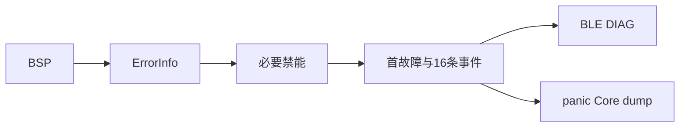

# 当前架构决策

> 模板只读：导入项目后，本文件应存放于 `docs/ADR-docs/templates/architecture-decisions.md`，禁止修改其中的任何内容。复制到 `docs/ADR-docs/architecture-decisions.md` 后，才可在项目文档副本中填写和维护当前项目情况；填写区以外的规范、字段和模板示例保持原样。详见项目中的 `docs/ADR-docs/templates/README.md`。

## 文档用途与维护要求

这份文档用于解释当前项目中重要架构选择的理由，帮助人和 AI 理解、修改并判断当前设计。

它重点回答：

- 当前采用什么方案，影响哪些范围？
- 为什么当前方案适合项目，有哪些取舍？
- 当前方案依赖哪些条件和约束？
- 有哪些代码、配置或测试依据，哪些结论尚未验证？
- 出现哪些可观察条件时，需要重新评估？

当前结构、功能入口和运行关系记录在 [`architecture.md`](./architecture.md)；本文件只记录当前有效的决策及其理由。

### 仅维护当前状态

- 每个架构主题只保留一份当前有效结论，不记录历史日志、旧方案、前后对比、迁移过程或已废弃决策。
- 决策发生变化时，直接重写对应主题的当前内容，并同步相关架构图、证据和链接；主题不再适用时，删除该主题及其失效引用。
- 取舍只解释当前方案的收益、代价和局限，不展开方案演化历史；尚未实施的方案不得描述为当前决策。
- 历史由版本控制系统保存，ADR 正文不维护时间线或版本快照。
- 证据不足时明确写“未知”或“未验证”，并关联 `architecture.md` 的 `Unknown / Unverified`；不得用推测补全设计理由。

### 组织方式与填写边界

以下规范和决策主题模板在项目中保持原样。项目文档副本仅在“项目真实决策”标记之后填写实际内容。

每个长期存在的架构问题使用二级标题 `## <决策主题>`，并保留模板中的全部字段及顺序。按实际主题重复条目；不适用项写明“不适用”及原因，不得删除字段或自行改造模板。

### 适合记录的决策

- 影响多个模块或长期维护方式的架构选择；
- 代码本身不足以解释的设计理由；
- 对当前方案至关重要的边界、约束和取舍；
- 可能因具体条件变化而需要重新评估的问题。

## 填写模板

### 决策主题模板

````markdown
## <决策主题>

**范围**

<受影响的功能、模块、接口或运行链路。>

**当前决策**

<当前实际采用的方案及关键边界。>

**为什么这样设计**

<当前方案满足哪些需求，关键收益、代价和局限是什么；理由未知时明确标注。>

**成立条件 / 约束**

- <当前依赖的资源、接口、所有权、并发、时序或平台约束。>

**需要重新评估的情况**

- <具体、可观察的触发条件；不是未来实施计划。>

**当前局部架构**


**当前架构位置**

- [`<对应功能或链路>`](./architecture.md#<anchor>)

**当前依据与验证边界**

- 依据：<当前源码路径与符号、配置、有效测试结果或外部约束来源。>
- 已核对：<证据直接支持的事实与范围；区分源码检查、编译、测试、仿真和硬件实测。>
- 未确认 / 未验证：<仍缺少的证据及验证方式；全部已确认时写“无”并说明核对范围。>
````

### “需要重新评估的情况”写法

尽量写成具体、可观察的触发条件，例如：

- 消费者数量超过 1 个；
- 数据需求变为每个样本都必须保存；
- 允许的端到端延迟小于当前已验证上限；
- 出现第二种硬件实现；
- 同步方式出现可测量的竞争或延迟；
- 外部接口或平台约束不再满足成立条件。

### 与 Architecture Change Gate 的关系

使用 [`architecture.md`](./architecture.md#architecture-change-gate) 中的只读检查清单判断是否需要更新项目文档副本。

架构策略、状态所有权、同步机制、模块职责、依赖关系背后的理由或关键约束变化时，以及命中重新评估条件时，核对并更新当前决策。不得追加历史记录，不得修改 `templates/` 中的文件。

---

<!-- 项目真实决策开始：仅在项目文档副本中，按上方模板添加当前有效的决策主题。 -->

## 组件边界与简单函数

**范围**

整个原生应用

**当前决策**

BSP与Middlewares各用一个组件根CMake；main按显式步骤初始化并直接创建静态任务；不引入通用任务工厂。

**为什么这样设计**

遵循项目约定，使启动顺序直接可见，硬件对象留在BSP；代价是任务创建参数显式重复。

**成立条件 / 约束**

- 固定板型和单实例模块；驱动访问不外溢至通信代码。

**需要重新评估的情况**

- 增加第二种板型或多个设备实例。

**当前局部架构**


**当前架构位置**

- [当前模块结构](./architecture.md#4-静态模块结构)
- [运行时链路与数据流](./architecture.md#5-运行时链路与数据流)

**当前依据与验证边界**

- 依据：main/app_main.cpp、components/BSP/CMakeLists.txt、components/Middlewares/CMakeLists.txt，项目AGENTS.md。
- 已核对：当前源码、配置与调用关系；当前固件通过ESP-IDF v6.0.2 Wi-Fi开/关构建；诊断测试见docs/codex/diagnostics_validation.md。
- 未确认 / 未验证：硬件实际行为、时限及故障恢复见[待验证项](./architecture.md#6-unknown--unverified)。

## 启动与硬件所有权

**范围**

电源、IMU和电机

**当前决策**

启动检查母线电压后才创建控制任务；控制任务内部初始化IMU及电机并重置姿态估计器。电机运行采用单Iq PI与六扇区SVPWM，库BLDCMotor仅用于对齐；BSP独占ADC1并在公共GPIO12使能关闭时校准零偏。当前源码硬件确认门为true；该布尔值并不能替代缺失的实板验证证据。

**为什么这样设计**

启动检查阻止低启动电压下进入控制链路；单任务持有硬件避免业务层交叉访问。运行时欠压保护并未实现。

**成立条件 / 约束**

- ADC检查先于Wi-Fi；initFOC可能驱动车轮；硬件操作必须经用户授权。

**需要重新评估的情况**

- 需要连续电池保护、独立电流环或多任务访问驱动。

**当前局部架构**


**当前架构位置**

- [当前模块结构](./architecture.md#4-静态模块结构)
- [运行时链路与数据流](./architecture.md#5-运行时链路与数据流)

**当前依据与验证边界**

- 依据：main/app_main.cpp、components/BSP/Power/power_monitor.cpp、components/BSP/Motor/motor_foc_service.cpp，项目AGENTS.md。
- 已核对：当前源码、配置与调用关系；当前固件通过ESP-IDF v6.0.2 Wi-Fi开/关构建；诊断测试见docs/codex/diagnostics_validation.md。
- 未确认 / 未验证：硬件实际行为、时限及故障恢复见[待验证项](./architecture.md#6-unknown--unverified)。

## 控制调度与状态所有权

**范围**

实时控制与静态诊断记录

**当前决策**

定时器只发送通知；ControlTask检查命令、到期IMU与倾倒，再读编码器、运行到期外环，随后采电流并以本周期目标执行Iq PI与SVPWM；姿态按5ms绝对截止点、速度及偏航累计10ms更新。ControlTask持有独立平衡使能，初始化完成后以零速/零偏航目标运行；BLE ARM只授权运动目标。首帧姿态直接以加速度计建立基准，倾倒检查先于首次电流输出。控制器使用函数和结构体；平衡电流优先分配，目标单位A。M0/M1的ForwardSign均为-1，按用户方向反馈同步反向目标电流与车辆轮速/Iq/Uq；FOC编码器对齐方向及相电流极性不随车辆映射改变，新的实板方向仍待验证。保留故障锁存停机。

**为什么这样设计**

保持执行顺序与状态所有权明确；通知合并避免积压逐次补算，但可能跳过释放点。BMI160芯片ODR为800Hz，软件姿态200Hz用于减少同步读取负载并与100Hz外环整分频；滤波权重按实际dt与98ms时间常数计算。闭环带宽、振动混叠与新时序尚未实测。

**成立条件 / 约束**

- Core 1优先级20，当前1000 Hz配置；电流PI按实际采样间隔运行，轮速按单圈角差计算；编码器读取耗时2ms、编码器到PWM年龄4ms、ADC读取耗时2ms、电流到PWM年龄2ms分别配置。4ms为用户授权的低速候选，不设实际轮速硬限；控制间隔保护10ms保留，新时序与闭环裕量未实测。

**需要重新评估的情况**

- 测得超期、任务饥饿、控制频率或时序要求变化。

**当前局部架构**



**当前架构位置**

- [当前模块结构](./architecture.md#4-静态模块结构)
- [运行时链路与数据流](./architecture.md#5-运行时链路与数据流)

**当前依据与验证边界**

- 依据：components/Middlewares/FreeRTOS/application_tasks.cpp、application_tasks.hpp、components/BSP/Common/vehicle_config.hpp，项目AGENTS.md。
- 已核对：当前源码、配置与调用关系；当前固件通过ESP-IDF v6.0.2 Wi-Fi开/关构建；诊断测试见docs/codex/diagnostics_validation.md。
- 未确认 / 未验证：硬件实际行为、时限及故障恢复见[待验证项](./architecture.md#6-unknown--unverified)。

## 通信与控制隔离

**范围**

BLE、Wi-Fi和遥测

**当前决策**

BLE通过短portMUX临界区共享固定RemoteState：回调提交请求，控制任务执行授权、300 ms超时与停止决策。控制任务分别发布BLE最新StatusSnapshot和TCP长度1静态队列，二者源自同一控制周期。NimBLE主机100 ms callout发送20字节READ/NOTIFY状态；Wi-Fi非阻塞服务单客户端TCP，CONFIG_VEHICLE_WIFI_ENABLED关闭全部Wi-Fi专用资源；TCP bool是次级开关，凭据存本机sdkconfig。

**为什么这样设计**

网络等待不进入控制链路；允许丢中间遥测帧，换取固定内存和最新状态。BLE轻量回报便于网页直接接入，TCP保留电脑调试用途。20字节适配默认MTU，通知失败丢弃本帧而不积压历史。独立停止/急停标记防止驾驶最新值覆盖安全事件。关闭TCP后仍可观察Wi-Fi连接日志。

**成立条件 / 约束**

- TCP v2保留原七列顺序并追加电流、Uq、相电流、周期和有效性共21列；保留.002 UUID但拒绝legacy驾驶；新网页用.004百分比D/A/S/E和.003状态，转向线上满量程保持原网页约±0.667的旧电压刻度，控制入口转换为±0.5 rad/s偏航目标。所有驾驶经v2；ARM同时要求boot_complete、run_allowed、无故障及急停，启动前请求不会延后自动生效。
- 新网页20 Hz串行发送，只有车辆确认A后才允许非零D；初始未连接及首次连接待授权时，本地零速平衡持续运行。松手/失焦/后台发S并关闭公共使能；超时与断连停机后需重新授权。停止事件序号跨重连保留，后续D和快速重连不能恢复平衡输出。S停机不保持站立。E锁存关闭输出，无线急停不具有硬实时保证。A不改变启动initFOC可能驱动车轮的事实。
- Wi-Fi/BLE共存使用WIFI_PS_MIN_MODEM；密码不进入ADR。通知使用NimBLE mbuf池，控制路径不分配和发送网络数据。

**需要重新评估的情况**

- 要求无损记录、多客户端或通信延迟超过可接受范围。

**当前局部架构**



**当前架构位置**

- [当前模块结构](./architecture.md#4-静态模块结构)
- [运行时链路与数据流](./architecture.md#5-运行时链路与数据流)

**当前依据与验证边界**

- 依据：components/Middlewares/BLE/ble_command_service.cpp、components/Middlewares/wifi_telemtry/wifi_telemtry.cpp、components/BSP/Common/vehicle_config.hpp，项目AGENTS.md。
- 已核对：当前源码、配置与调用关系；当前固件通过ESP-IDF v6.0.2 Wi-Fi开/关构建；诊断测试见docs/codex/diagnostics_validation.md。
- 未确认 / 未验证：硬件实际行为、时限及故障恢复见[待验证项](./architecture.md#6-unknown--unverified)。


## 故障证据与持久化边界

**范围**

启动检查、BSP错误传播、ControlTask停机、BLE DIAG、Flash Core dump。

**当前决策**

普通函数返回esp_err_t及调用者持有的ErrorInfo。先必要禁能，再锁存首故障和最后有效现场，次级禁能错误单独记录；不使用全局last_error。固定16条事件与独立首故障槽使用短临界区，序号表示提交顺序。NimBLE callout按订阅重放首故障与历史，每次至多提交一条DIAG事件。g_diag_crash使用COREDUMP_DRAM_ATTR；Flash只在panic保存，启用NO_OVERWRITE，不自动擦除。

串口运行诊断复用app_main每100ms观察首帧/首个平衡周期，首次平衡成功或故障后返回；启动前已收到停止事件时等待重新ARM。运行中只写定长计时快照，balancing与driving分别表示平衡使能和遥控授权，故障冻结当轮阶段与耗时，禁能并停止定时器后一次性打印。output_age使用用户授权的4ms编码器年龄门，新增current_output_age独立检查2ms电流年龄，两者在PWM前后检查并报告各自实测值；读取耗时仍分别限2ms，原始时间起点不变。4ms通过不等于1kHz周期验收。RAM布局schema=3，无线schema保持1。首轮控制/姿态dt显式初始化，后续继续按实际间隔保护。

**为什么这样设计**

保留底层错误、通道和源码位置，同时让控制路径没有文本格式化、网络发送、动态分配或Flash写入。代价是普通故障RAM记录在掉电后丢失，历史环可覆盖，通知不能证明客户端已保存；旧dump占用分区时新panic不会覆盖它。

**成立条件 / 约束**

- 固定板型、单控制所有者；128 KiB dump分区保持原布局，解码必须使用匹配ELF。

**需要重新评估的情况**

- 要求普通故障跨掉电保留、无损历史、客户端确认或dump尺寸超出分区。

**当前局部架构**



**当前架构位置**

- [运行诊断](./architecture.md#运行诊断)

**当前依据与验证边界**

- 依据：error_info.hpp、diagnostic_store.hpp、diagnostics.cpp、application_tasks.cpp、ble_command_service.cpp、sdkconfig.defaults和partitions.csv。
- 已核对：固定资源、错误传播、测试及开/关构建；详见docs/codex/diagnostics_validation.md。
- 未确认 / 未验证：实板上电、禁能、实时性、手机GATT缓存、订阅/重连以及Flash dump保存和匹配ELF解码。
