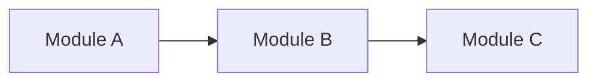
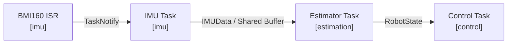
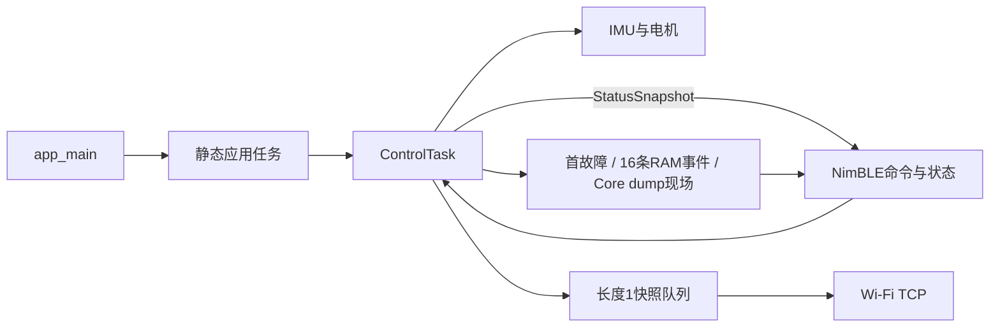
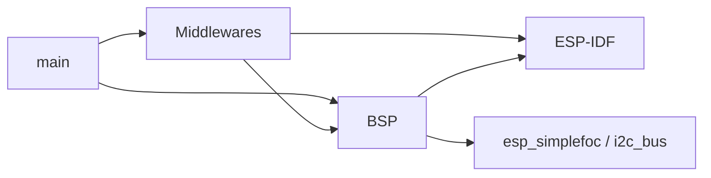
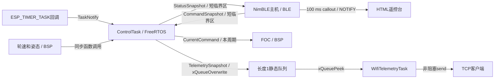

# 项目架构

> 模板只读：导入项目后，本文件应存放于 `docs/ADR-docs/templates/architecture.md`，禁止修改其中的任何内容。复制到 `docs/ADR-docs/architecture.md` 后，才可在项目文档副本中填写和维护当前项目情况；填写区以外的规范、字段和模板示例保持原样。详见项目中的 `docs/ADR-docs/templates/README.md`。

## 文档用途与维护要求

这份文档同时服务于人和 AI，用来建立并持续维护项目的当前心智模型。

它重点回答：

- 项目现在由哪些核心功能和模块组成？
- 一个功能运行时从哪里进入？
- 如果要理解或修改某个功能，应该从哪里开始读？
- 模块之间如何依赖？
- Task / ISR / Thread 等运行单元如何协作？
- 关键数据如何在模块和运行单元之间流动？
- 当前还有哪些关系尚未确认？

当前结构和运行关系记录在本文件中；当前有效的设计理由、约束和取舍记录在 [`architecture-decisions.md`](./architecture-decisions.md)。

### 仅维护当前状态

- 仅记录当前代码、配置和已核实运行方式；不记录变更日志、旧架构、迁移过程或已废弃方案。
- 项目变化时直接改写对应内容，删除失效描述，并同步修正相关图表、链接和决策；不追加历史快照。
- 未实现的方案不得写成当前事实；当前无法确认的关系记录到 `Unknown / Unverified`，确认后更新对应正文并移除已解决条目。
- 版本历史由版本控制系统保存，不在 ADR 正文中重复维护。

### 更新时机

当以下内容发生变化时，同步更新本文档：

- Feature 的职责或所属模块；
- Runtime Entry、Change Entry 或主要执行路径；
- 模块边界或依赖方向；
- Task / ISR / Thread / Worker 的职责或协作关系；
- 关键数据的生产者、消费者、传输方式或所有权；
- 常见修改的推荐阅读路径。

### Verification

项目文档副本的 Frontmatter 中，`verification` 用于说明当前内容的核对依据和范围，更新时覆盖原值，不追加核对历史：

- `status`：`verified` / `partial` / `unverified`
- `basis`：基于哪个工作区状态或 commit
- `scope`：核对了整个项目、改动区域还是某个子系统

`verified` 仅表示声明范围内的内容已由证据核对，不代表已完成编译、测试、仿真或硬件验证。源码核对与实测结论必须区分；未验证的行为、时序和指标放入 `Unknown / Unverified`。

---

## 填写模板

以下规范和条目模板在项目中保持原样。仅在项目文档副本中填写 Frontmatter 的 `verification` 值及“项目真实文档”区域；该区域必须保留六个章节及规定字段，按模板填写占位符、图表和条目。不适用项写明“不适用”及原因，不得删除字段或自行改造结构。

### Feature Navigation 条目模板

```markdown
### <功能名称>

**功能职责**

<这个功能负责什么，它的边界是什么。>

**所属模块**

`<module-or-package>`

**Runtime Entry**

`<symbol-or-path>`

<程序运行时，事件或执行流从哪里进入这个功能。>

**Change Entry**

`<symbol-or-path>`

<如果要理解或修改这个功能，最适合首先阅读的位置。>

**Main Path**

`<Entry>` → `<Core>` → `<State / Dependency>` → `<Output>`

**输入**

- `<input/event/data>`

**输出**

- `<output/event/data>`

**关键组件**

- `<path-or-symbol>` — <职责>
- `<path-or-symbol>` — <职责>

**相关架构决策**

- [`<Decision Topic>`](./architecture-decisions.md#<anchor>)

**已知约束**

- <约束>
```

其中：

- `Runtime Entry` 描述“程序从哪里进入这个功能”。
- `Change Entry` 描述“从哪里进入这段代码最容易理解和修改”。
- `Main Path` 描述最有代表性的主路径，通常保持在 3～6 个节点。
- `关键组件` 只列出理解该功能真正重要的代码位置。

### Change Guide 模板


| 我想修改…… | 从这里开始 | 推荐阅读路径 | 如何验证 | 相关 ADR |
| --- | --- | --- | --- | --- |
| `<功能 A>` | `<Change Entry>` | `<A → B → C>` | `<test/command>` | `<ADR topic / ->` |


### 静态模块结构模板

静态模块结构描述代码组织和长期依赖方向，回答“谁依赖谁”。


| 模块 | 主要职责 | 对外入口 / 接口 | 依赖 |
| --- | --- | --- | --- |
| `<module-a>` | `<responsibility>` | `<API/interface>` | `<module-b>` |




### 运行时链路模板

运行时链路把 **执行单元、数据、同步方式和模块** 放在同一条路径里描述，回答“系统实际怎么跑”。


### <链路名称>

**作用**

<这条链路完成什么。>

**主路径**



**运行单元**

| 运行单元 | 所属模块 | 触发 / 频率 | 职责 | 同步 / 通信 |
| --- | --- | --- | --- | --- |
| `<TaskA>` | `<module>` | `<1000 Hz / event>` | `<responsibility>` | `<Queue / Notify / Mutex>` |

**关键数据**

| 数据 | 生产者 | 消费者 | 所有权 / 生命周期 | 传输方式 |
| --- | --- | --- | --- | --- |
| `<DataType>` | `<producer>` | `<consumer>` | `<owner>` | `<Queue / Buffer / API>` |

### Unknown / Unverified 模板


| 状态 | 区域 | 问题 / 当前判断 | 还缺少什么信息 | 验证方式 |
| --- | --- | --- | --- | --- |
| `Unknown` | `<feature/module>` | `<question>` | `<missing information>` | `<files/tests/commands>` |
| `Unverified` | `<feature/module>` | `<hypothesis>` | `<missing evidence>` | `<verification path>` |
| `Suspected Drift` | `<feature/module>` | `<possible mismatch>` | `<evidence needed>` | `<verification path>` |


### Architecture Change Gate

完成较大的功能开发、重构或跨文件修改后，用下面的问题判断是否需要同步项目文档副本。此表是只读检查清单，不在模板或正文中逐次填写检查结果，也不积累 change 记录。

| 检查项 | 结果 |
| --- | --- |
| Feature 职责或归属是否变化？ | `<Yes/No/Unverified>` |
| 模块边界或依赖方向是否变化？ | `<Yes/No/Unverified>` |
| Runtime Entry、Change Entry 或 Main Path 是否变化？ | `<Yes/No/Unverified>` |
| Task / ISR / Thread / Worker 的关系是否变化？ | `<Yes/No/Unverified>` |
| 同步方式或状态所有权是否变化？ | `<Yes/No/Unverified>` |
| 关键数据流或数据契约是否变化？ | `<Yes/No/Unverified>` |
| 架构策略、约束或重要 trade-off 是否变化？ | `<Yes/No/Unverified>` |

对应动作：

- 当前结构、运行关系或数据流发生变化 → 更新 `architecture.md`
- 架构策略、约束或设计理由发生变化 → 更新 `architecture-decisions.md`
- 两类变化同时发生 → 同步更新两份文档
- 某项仍待确认 → 记录到 `Unknown / Unverified`
- 所有检查项均为 `No` → 本次无需更新架构文档

---

## 项目真实文档

### 1. 项目概览

当前项目是 DengFOC V4 / ESP32-WROOM-32 的原生 ESP-IDF v6.0.2 C++ 平衡车固件。main完成一次性启动，ControlTask持有控制器状态并执行传感器、FOC和控制计算；可选Wi-Fi任务消费最新快照；诊断使用静态事件环和首故障槽。BLE以NimBLE回调提交命令，控制任务执行授权/超时/停止决策；NimBLE主机每100 ms回传最新状态。

当前电机执行量为iq电流，BSP显式Iq投影、单Iq PI及第十一课六扇区SVPWM；控制任务请求1000 us，姿态按2ms绝对截止点、速度/转向累计10 ms更新。当前硬件确认门为true；本次没有修改该值，实板验证证据仍缺失。初始化先建立GPIO12低电平，按固定步骤检查并在BOOT_SUMMARY后放行控制。Wi-Fi服务周期50 ms；BLE DIAG复用100 ms callout。不存在独立IMU任务或DRDY ISR链路。详见[三环控制](../codex/control/current_cascade_tuning.md)。

#### 整体关系图



---

### 2. Feature Navigation Map

这一节按“功能”而不是按“目录”组织项目。

#### 启动与电源检查

**功能职责**

建立静态队列，初始化电源、检查启动电压并启动BLE，依次创建诊断、控制和Wi-Fi任务。

**所属模块**

`main / BSP/Power`

**Runtime Entry**

`app_main()`

**Change Entry**

[main/app_main.cpp](../../main/app_main.cpp)

**Main Path**

`app_main → 安全态 / power / NVS / BLE / 可选Wi-Fi → ControlTask初始化 → BOOT_SUMMARY`

**输入**

- 启动事件、ADC母线电压

**输出**

- 任务上下文、任务句柄

**关键组件**

- `main/app_main.cpp` — 功能入口与实现。
- `components/BSP/Power/power_monitor.cpp` — 关联配置、接口或处理实现。

**相关架构决策**

- [启动与硬件所有权](./architecture-decisions.md#启动与硬件所有权)

**已知约束**

- 电压仅启动时检查；失败不创建后续控制链路。

#### 姿态与电机控制

**功能职责**

顺序核验编码器与相电流，运行电流PI；分频采集姿态，计算速度PI、姿态PD、偏航PI及左右目标电流。

**所属模块**

`FreeRTOS / BSP / Control`

**Runtime Entry**

`controlTask()`

**Change Entry**

[components/Middlewares/FreeRTOS/application_tasks.cpp](../../components/Middlewares/FreeRTOS/application_tasks.cpp)

**Main Path**

`定时器通知 → 命令与急停检查 → 轮速与姿态 → control::update → motor::runCurrentControl`

**输入**

- BLE命令、轮速、俯仰角

**输出**

- 本周期目标电流、TelemetrySnapshot

**关键组件**

- `components/Middlewares/FreeRTOS/application_tasks.cpp` — 功能入口与实现。
- `components/Middlewares/Control/balance_controller.cpp` — 关联配置、接口或处理实现。

**相关架构决策**

- [控制调度与状态所有权](./architecture-decisions.md#控制调度与状态所有权)

**已知约束**

- FOC消费本周期新目标；控制目标频率1000 Hz，不代表实测保证。

#### BLE命令与状态回传

**功能职责**

NimBLE特征回调严格解析命令，控制任务通过latestCommand执行授权和300 ms超时判断；publishStatus复制本周期数据，NimBLE主机发送10 Hz状态通知。

**所属模块**

`Middlewares/BLE`

**Runtime Entry**

`characteristicAccess() / gapEvent() / notifyStatus()`

**Change Entry**

[components/Middlewares/BLE/ble_command_service.cpp](../../components/Middlewares/BLE/ble_command_service.cpp)

**Main Path**

`GATT写入 → acceptCommand → latestCommand / stepRemote → 控制任务 → publishStatus → notifyStatus`

**输入**

- 网页命令及连接事件

**输出**

- CommandSnapshot、20字节状态READ/NOTIFY

**关键组件**

- `components/Middlewares/BLE/ble_command_service.cpp` — 功能入口与实现。
- `docs/平衡车控制界面（新版）.html` — v2遥控、状态采样序号观察、DIAG摘要/事件去重与JSON导出；旧页面保留作参考。

**相关架构决策**

- [通信与控制隔离](./architecture-decisions.md#通信与控制隔离)

**已知约束**

- .002特征READ返回legacy control unsupported、WRITE拒绝；.004保留D/A/S/E，.003保留20字节状态。新增.005 DIAG：READ 20字节元信息，NOTIFY 14字节错误事件。ARM同时检查启动完成、允许运行、无故障与急停。

- 新版网页连接后读取.005并订阅首故障/历史事件，按每次连接与event_seq去重，保留最近8次连接供JSON导出；以.003 sample_sequence变化观察控制循环。未传输的完整ErrorInfo/控制快照及Flash dump不在页面中显示。网页Node协议/连接测试通过，实板BLE仍为Unverified。
- 命令和状态用短portMUX临界区保护，解析及网络发送在锁外；停止事件独立锁存，急停关闭输出后需人工处理并重启。所有legacy驾驶请求拒绝；急停和故障锁存跨重连保留。
- 协议字段和验证步骤见[任务与协议](../codex/tasks/ble_control_telemetry.md)。

#### Wi-Fi TCP调试

**功能职责**

连接本机配置的网络，并向单个TCP客户端发送最新状态。

**所属模块**

`Middlewares/wifi_telemtry`

**Runtime Entry**

`wifiTelemetryTask() / wifiEvent()`

**Change Entry**

[components/Middlewares/wifi_telemtry/wifi_telemtry.cpp](../../components/Middlewares/wifi_telemtry/wifi_telemtry.cpp)

**Main Path**

`Wi-Fi事件 → service → 队列快照 → 非阻塞TCP`

**输入**

- 启动/断线/IP事件、TelemetrySnapshot

**输出**

- 3333端口的LF分隔CSV、连接诊断日志

**关键组件**

- `components/Middlewares/wifi_telemtry/wifi_telemtry.cpp` — 功能入口与实现。
- `components/BSP/Common/vehicle_config.hpp` — 关联配置、接口或处理实现。

**相关架构决策**

- [通信与控制隔离](./architecture-decisions.md#通信与控制隔离)

**已知约束**

- CONFIG_VEHICLE_WIFI_ENABLED为总开关，关闭时无Wi-Fi初始化、专用任务、队列和遥测写入；kWifiTcpDebugEnabled只控制启用Wi-Fi后的TCP。

#### 运行诊断

**功能职责**

输出固定boot_step的BEGIN/OK/FAIL/SKIP/DEGRADED日志；保留ErrorInfo、16条事件、首故障、最后BLE异常与控制现场。

**所属模块**

`Middlewares/Diagnostics`

**Runtime Entry**

`diagnostics::boot / record / controlSnapshot`

**Change Entry**

[components/Middlewares/Diagnostics/diagnostics.cpp](../../components/Middlewares/Diagnostics/diagnostics.cpp)

**Main Path**

`检测点ErrorInfo → 必要禁能 → 首故障及现场 → 16条RAM事件 → BLE DIAG / panic Core dump`

**输入**

- 初始化阶段、底层错误、原始错误域/码、有效现场数据

**输出**

- 启动串口日志、DIAG无线包、COREDUMP_DRAM_ATTR g_diag_crash

**关键组件**

- `components/Middlewares/Diagnostics/diagnostics.cpp` — 功能入口与实现。
- `components/Middlewares/FreeRTOS/application_tasks.hpp` — 关联配置、接口或处理实现。

**相关架构决策**

- [控制调度与状态所有权](./architecture-decisions.md#控制调度与状态所有权)

**已知约束**

- 不新增诊断任务或普通错误Flash日志；Flash dump保留旧内容，仅panic生成。Notify成功只表示本地提交。

---

### 3. Change Guide

| 我想修改…… | 从这里开始 | 推荐阅读路径 | 如何验证 | 相关 ADR |
| --- | --- | --- | --- | --- |
| 启动检查 | main/app_main.cpp | app_main → power_monitor → BLE首次广播 → controlTask启动 | IDF编译；授权后检查欠压启动分支 | 启动与硬件所有权 |
| 控制算法与周期 | application_tasks.cpp | vehicle_config → balance_controller → motor_foc_service | 编译、时序审查；授权后测周期和输出 | 控制调度与状态所有权 |
| GPIO与驱动 | board_pins.hpp | 原理图 → 板级映射 → BSP | 核对实物资料、编译及授权硬件测试 | 启动与硬件所有权 |
| BLE协议与网页 | remote_protocol.hpp | HTML → parseCommand / acceptCommand → latestCommand → publishStatus | IDF编译期断言、tests/diagnostics故障注入、Python DIAG测试；授权后实机验证 | 通信与控制隔离 |
| Wi-Fi与TCP开关 | wifi_telemtry.cpp | vehicle_config → Kconfig.projbuild → service | 编译；上板测开关、断网恢复和慢客户端 | 通信与控制隔离 |

---

### 4. 静态模块结构

这一节描述长期稳定的模块边界和依赖方向。

它关注的是“代码结构上的依赖”，而不是运行时数据如何流动。

#### 模块职责

| 模块 | 主要职责 | 对外入口 / 接口 | 依赖 |
| --- | --- | --- | --- |
| main | 启动和静态资源 | app_main | BSP、Middlewares、FreeRTOS |
| BSP/Board、Common | GPIO和参数 | board::pins、config | ESP-IDF类型 |
| BSP/Power | 启动母线ADC与校准 | initialize / readBusVoltage | esp_adc、Board |
| BSP/IMU | BMI160初始化与互补估计 | initialize / resetEstimator / readAttitude | i2c_bus、Board、Common |
| BSP/Motor | 编码器、驱动和FOC对象 | initialize / readWheelState / runCurrentControl / pauseOutputs / disableOutputs | esp_simplefoc、Board |
| Middlewares/Control | 速度/转向PI、姿态PD和电流分配 | initialize / update | Common |
| Middlewares/FreeRTOS | 控制及可选Wi-Fi任务 | controlTask / wifiTelemetryTask | BSP及通信、控制、诊断模块 |
| Middlewares/BLE | GATT、命令状态机、状态回报 | initialize / latestCommand / publishStatus / publishFault | NimBLE、NVS、FreeRTOS、esp_timer |
| Middlewares/wifi_telemtry | STA和单客户端TCP | initialize / service | esp_wifi、esp_event、esp_netif、lwIP |
| Middlewares/Diagnostics | 启动、事件、首故障及崩溃现场 | boot / record / replay / metadata | BSP/Common ErrorInfo、log、FreeRTOS |

#### 模块依赖图



#### 关键依赖规则

- 项目自定义组件组为BSP和Middlewares，各自仅根目录一个CMakeLists.txt；main为应用入口组件。
- Middlewares和main采用函数、结构体及必要静态状态；第三方FOC对象限定在BSP内部。
- 托管依赖由组件清单与dependencies.lock记录。参考Arduino项目不参加原生构建。
- BSP与Middlewares启用-O3及-ffast-math；浮点异常保护的有效性需考虑优化选项。

---

### 5. 运行时链路与数据流

这一节统一描述当前任务关系和数据流。

阅读顺序建议是：

> **先看一条完整链路 → 再看其中有哪些运行单元 → 最后看关键数据如何传输。**

每一条核心链路都应同时体现：

- 所属模块；
- Task / ISR / Thread 等运行单元；
- 触发或调度关系；
- 数据类型；
- Queue / Notification / Buffer / API 等通信方式；
- 最终输出。

#### 控制、命令与遥测链路

**作用**

启动顺序为安全输出、诊断静态存储、电源/电压、NVS/dump检查、BLE首次广播、可选Wi-Fi、IMU、电机/零偏/编码器/右对齐/左对齐、关闭输出、定时器、BOOT_SUMMARY、控制放行。IMU及电机由ControlTask持有并初始化；必要步骤失败锁存停机，可选Wi-Fi失败降级。

**主路径**



**运行单元**

| 运行单元 | 所属模块 | 触发 / 频率 | 职责 | 同步 / 通信 |
| --- | --- | --- | --- | --- |
| app_main | main | 启动一次 | 检查及创建静态资源后删除自身 | TaskContext |
| ESP_TIMER_TASK回调 | ESP-IDF / FreeRTOS | 请求1000 us | 通知控制任务 | xTaskNotifyGive |
| ControlTask | FreeRTOS | Core 1，优先级20，目标1000 Hz | 电流FOC，分频IMU与外环 | ulTaskNotifyTake(pdTRUE)、队列覆盖 |
| WifiTelemetryTask | FreeRTOS | Core 0，优先级4，每50 ms，仅总开关启用时存在 | 推进TCP | vTaskDelayUntil、队列peek、事件位 |
| NimBLE主机回调 | BLE | Core 0，事件驱动及100 ms callout | 协议解析、连接处理、20字节状态及至多一条14字节DIAG通知 | 短portMUX临界区、NPL事件队列 |
| Wi-Fi/IP事件回调 | wifi_telemtry | 事件驱动 | 就绪位、连接请求位和诊断日志 | 静态EventGroup |

**关键数据**

| 数据 | 生产者 | 消费者 | 所有权 / 生命周期 | 传输方式 |
| --- | --- | --- | --- | --- |
| ControllerState | controlTask初始化及update | 控制器 | 控制任务栈，任务生命周期 | 引用 |
| CommandSnapshot | BLE接收请求，控制任务stepRemote执行决策 | 控制任务 | BLE静态RemoteState；返回值为副本 | portMUX保护，停止/急停独立标记 |
| StatusSnapshot | 控制任务 | NimBLE主机 | BLE静态最新值；不保留历史 | publishStatus短临界区复制，通知每100 ms发送 |
| WheelState / AttitudeSample | BSP同步读取 | 控制任务 | 本周期局部值；估计器历史由IMU内部持有 | 函数返回 |
| CurrentCommand | 控制器输出 | 电机服务 | 本周期局部值，采样后立即闭环 | runCurrentControl |
| TelemetrySnapshot | 控制任务 | Wi-Fi任务 | main静态长度1队列 | 覆盖与复制，允许丢弃中间帧 |
| pending发送缓冲区 | TCP service | socket | Wi-Fi任务独占，768字节 | 保存部分发送偏移 |
| TaskContext | main | 控制与可选Wi-Fi任务 | 文件静态生命周期 | Wi-Fi启用时持有队列句柄 |
| g_diag_crash | 启动、ControlTask、NimBLE | DIAG、panic Core dump | 固定DRAM，短临界区 | 16条事件、独立首故障、有效/故障快照、BLE状态 |

TCP v2每行21列：原七列后追加左右实测Iq、左右Uq、六路相电流、current_dt_s、current_sample_age_us、current_saturated、current_valid；LF分帧，速度差为左减右。快照sequence用于本机去重，不是CSV字段；device_time_us为控制周期入口时间，不是逐传感器采样时刻。慢客户端阻塞约1秒后关闭连接，实际判断受50 ms服务节拍影响。

---

### 6. Unknown / Unverified

| 状态 | 区域 | 问题 / 当前判断 | 还缺少什么信息 | 验证方式 |
| --- | --- | --- | --- | --- |
| Unverified | 电流控制 | 硬件确认门当前true；相序、极性、增益及采样同步仍缺乏实测证据 | 台架电流与时序数据 | 依三环控制说明逐环验证 |
| Unverified | 整机 | 当前工作区固件已通过ESP-IDF v6.0.2全项目编译；未烧录验证 | 对应固件运行结果 | 授权后烧录与上板测试 |
| Unverified | 实时性 | 1000 Hz是配置；通知积压由pdTRUE合并，不证明每个释放点均执行 | WCET、抖动、丢周期、栈余量 | 测量定时、GPIO与诊断日志 |
| Unverified | BLE与停止行为 | v2/DIAG与故障注入本机测试通过；未实机验证 | MTU、通知、命令延迟、公共使能关闭后的实际停止距离、急停延迟和栈余量 | 授权后保护架与断连/后台/共存测试 |
| Unverified | Wi-Fi/TCP | 自动连接、断线重试及bool开关尚无实机结果 | AP兼容性、重连和客户端数据 | 分别测试开关、断网、慢客户端 |
| Unverified | 传感器与安全 | 同步读寄存器不能证明新样本率或跨传感器同步；WheelState.valid检查编码器读取、ADC量程与年龄 | 时戳、总线故障检测、姿态真值 | 注入读失败并与参考姿态比较 |
| Unverified | 浮点保护 | Motor、IMU、Control与控制任务关闭fast-math；第三方库行为仍需实板检查 | 优化后二进制行为 | 独立故障注入和编译选项审查 |
| Unverified | 硬件映射 | docs/codex/hardware/board_dengfoc_v4.md已对照原理图与例程，GPIO12公共使能、GPIO22为CS0 | 实际接线与极性 | 台架核验 |
| Unverified | Core dump | 配置保留旧dump，g_diag_crash进入专用DRAM段；未实板验证 | 保存完整性、匹配ELF解码、人工清除流程 | 维护命令及授权台架测试 |
| Unverified | 运行电压 | 仅启动时检查ADC；没有持续欠压保护 | 电池下降及供电扰动测试 | 授权台架测试 |

