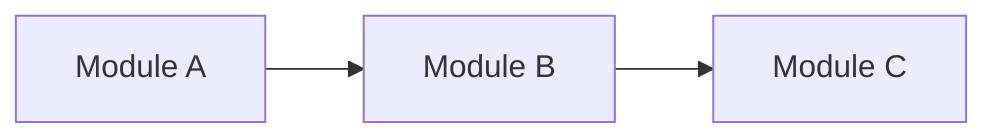
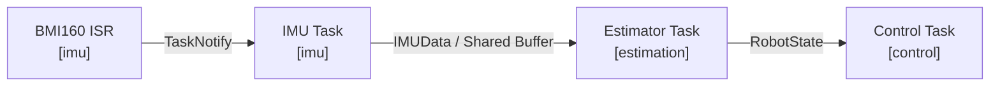
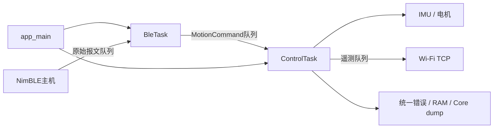
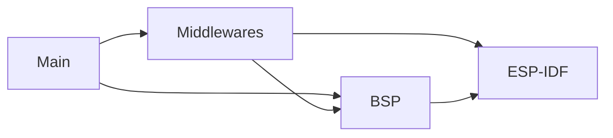
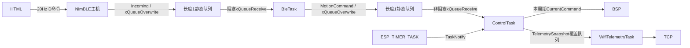

# 项目架构

> 模板只读：导入项目后，本文件应存放于 `docs/ADR-docs/templates/architecture.md`，禁止修改其中的任何内容。复制到 `docs/ADR-docs/architecture.md` 后，才可在项目文档副本中填写和维护当前项目情况；填写区以外的规范、字段和模板示例保持原样。详见项目中的 `docs/ADR-docs/templates/README.md`。

## 文档用途与维护要求

这份文档同时服务于人和 AI，用来建立并持续维护项目的当前心智模型。

它重点回答：

- 项目现在由哪些核心功能和模块组成？
- 一个功能运行时从哪里进入？
- 如果要理解或修改某个功能，应该从哪里开始读？
- 模块之间如何依赖？
- Task / ISR / Thread 等运行单元如何协作？
- 关键数据如何在模块和运行单元之间流动？
- 当前还有哪些关系尚未确认？

当前结构和运行关系记录在本文件中；当前有效的设计理由、约束和取舍记录在 [`architecture-decisions.md`](./architecture-decisions.md)。

### 仅维护当前状态

- 仅记录当前代码、配置和已核实运行方式；不记录变更日志、旧架构、迁移过程或已废弃方案。
- 项目变化时直接改写对应内容，删除失效描述，并同步修正相关图表、链接和决策；不追加历史快照。
- 未实现的方案不得写成当前事实；当前无法确认的关系记录到 `Unknown / Unverified`，确认后更新对应正文并移除已解决条目。
- 版本历史由版本控制系统保存，不在 ADR 正文中重复维护。

### 更新时机

当以下内容发生变化时，同步更新本文档：

- Feature 的职责或所属模块；
- Runtime Entry、Change Entry 或主要执行路径；
- 模块边界或依赖方向；
- Task / ISR / Thread / Worker 的职责或协作关系；
- 关键数据的生产者、消费者、传输方式或所有权；
- 常见修改的推荐阅读路径。

### Verification

项目文档副本的 Frontmatter 中，`verification` 用于说明当前内容的核对依据和范围，更新时覆盖原值，不追加核对历史：

- `status`：`verified` / `partial` / `unverified`
- `basis`：基于哪个工作区状态或 commit
- `scope`：核对了整个项目、改动区域还是某个子系统

`verified` 仅表示声明范围内的内容已由证据核对，不代表已完成编译、测试、仿真或硬件验证。源码核对与实测结论必须区分；未验证的行为、时序和指标放入 `Unknown / Unverified`。

---

## 填写模板

以下规范和条目模板在项目中保持原样。仅在项目文档副本中填写 Frontmatter 的 `verification` 值及“项目真实文档”区域；该区域必须保留六个章节及规定字段，按模板填写占位符、图表和条目。不适用项写明“不适用”及原因，不得删除字段或自行改造结构。

### Feature Navigation 条目模板

```markdown
### <功能名称>

**功能职责**

<这个功能负责什么，它的边界是什么。>

**所属模块**

`<module-or-package>`

**Runtime Entry**

`<symbol-or-path>`

<程序运行时，事件或执行流从哪里进入这个功能。>

**Change Entry**

`<symbol-or-path>`

<如果要理解或修改这个功能，最适合首先阅读的位置。>

**Main Path**

`<Entry>` → `<Core>` → `<State / Dependency>` → `<Output>`

**输入**

- `<input/event/data>`

**输出**

- `<output/event/data>`

**关键组件**

- `<path-or-symbol>` — <职责>
- `<path-or-symbol>` — <职责>

**相关架构决策**

- [`<Decision Topic>`](./architecture-decisions.md#<anchor>)

**已知约束**

- <约束>
```

其中：

- `Runtime Entry` 描述“程序从哪里进入这个功能”。
- `Change Entry` 描述“从哪里进入这段代码最容易理解和修改”。
- `Main Path` 描述最有代表性的主路径，通常保持在 3～6 个节点。
- `关键组件` 只列出理解该功能真正重要的代码位置。

### Change Guide 模板


| 我想修改…… | 从这里开始 | 推荐阅读路径 | 如何验证 | 相关 ADR |
| --- | --- | --- | --- | --- |
| `<功能 A>` | `<Change Entry>` | `<A → B → C>` | `<test/command>` | `<ADR topic / ->` |


### 静态模块结构模板

静态模块结构描述代码组织和长期依赖方向，回答“谁依赖谁”。


| 模块 | 主要职责 | 对外入口 / 接口 | 依赖 |
| --- | --- | --- | --- |
| `<module-a>` | `<responsibility>` | `<API/interface>` | `<module-b>` |




### 运行时链路模板

运行时链路把 **执行单元、数据、同步方式和模块** 放在同一条路径里描述，回答“系统实际怎么跑”。


### <链路名称>

**作用**

<这条链路完成什么。>

**主路径**



**运行单元**

| 运行单元 | 所属模块 | 触发 / 频率 | 职责 | 同步 / 通信 |
| --- | --- | --- | --- | --- |
| `<TaskA>` | `<module>` | `<1000 Hz / event>` | `<responsibility>` | `<Queue / Notify / Mutex>` |

**关键数据**

| 数据 | 生产者 | 消费者 | 所有权 / 生命周期 | 传输方式 |
| --- | --- | --- | --- | --- |
| `<DataType>` | `<producer>` | `<consumer>` | `<owner>` | `<Queue / Buffer / API>` |

### Unknown / Unverified 模板


| 状态 | 区域 | 问题 / 当前判断 | 还缺少什么信息 | 验证方式 |
| --- | --- | --- | --- | --- |
| `Unknown` | `<feature/module>` | `<question>` | `<missing information>` | `<files/tests/commands>` |
| `Unverified` | `<feature/module>` | `<hypothesis>` | `<missing evidence>` | `<verification path>` |
| `Suspected Drift` | `<feature/module>` | `<possible mismatch>` | `<evidence needed>` | `<verification path>` |


### Architecture Change Gate

完成较大的功能开发、重构或跨文件修改后，用下面的问题判断是否需要同步项目文档副本。此表是只读检查清单，不在模板或正文中逐次填写检查结果，也不积累 change 记录。

| 检查项 | 结果 |
| --- | --- |
| Feature 职责或归属是否变化？ | `<Yes/No/Unverified>` |
| 模块边界或依赖方向是否变化？ | `<Yes/No/Unverified>` |
| Runtime Entry、Change Entry 或 Main Path 是否变化？ | `<Yes/No/Unverified>` |
| Task / ISR / Thread / Worker 的关系是否变化？ | `<Yes/No/Unverified>` |
| 同步方式或状态所有权是否变化？ | `<Yes/No/Unverified>` |
| 关键数据流或数据契约是否变化？ | `<Yes/No/Unverified>` |
| 架构策略、约束或重要 trade-off 是否变化？ | `<Yes/No/Unverified>` |

对应动作：

- 当前结构、运行关系或数据流发生变化 → 更新 `architecture.md`
- 架构策略、约束或设计理由发生变化 → 更新 `architecture-decisions.md`
- 两类变化同时发生 → 同步更新两份文档
- 某项仍待确认 → 记录到 `Unknown / Unverified`
- 所有检查项均为 `No` → 本次无需更新架构文档

---

## 项目真实文档

### 1. 项目概览

DengFOC V4 / ESP32-WROOM-32原生ESP-IDF v6.0.2固件。app_main建立静态资源并启动任务；BleTask负责蓝牙初始化、命令解析及速度/偏航目标转换；ControlTask独占传感器、电机和故障停机；可选Wi-Fi任务输出TCP遥测。错误统一为BSP/Common/error_info.hpp中的ErrorInfo / ErrorPoint，不再提供BLE状态码或DIAG回传。

电机执行量为iq电流，BSP采用显式Iq投影、单Iq PI与六扇区SVPWM；两轮车辆前进映射均为-1。控制周期目标1000us，姿态5000us，速度/偏航10000us。初始化完成后独立零速平衡，BLE只改变运动目标；断连/过期目标归零，故障锁存停机。硬件确认门当前true，但实板证据仍未验证。详见[三环控制](../codex/control/current_cascade_tuning.md)。

#### 整体关系图



---

### 2. Feature Navigation Map

这一节按“功能”而不是按“目录”组织项目。

#### 启动与电源检查

**功能职责**

建立安全输出，检查电源、NVS及dump；创建BleTask并等待首次广播结果，再启动控制与可选Wi-Fi任务。

**所属模块**

`main / BSP/Power`

**Runtime Entry**

`app_main()`

**Change Entry**

[main/app_main.cpp](../../main/app_main.cpp)

**Main Path**

`app_main → 电源/NVS → BleTask → 启动结果队列 → ControlTask`

**输入**

- 启动事件、母线电压

**输出**

- 静态任务、队列及启动结果

**关键组件**

- `main/app_main.cpp` — 功能入口与实现。

**相关架构决策**

- [启动与硬件所有权](./architecture-decisions.md#启动与硬件所有权)

**已知约束**

- 电压仅启动检查；必要初始化失败不放行控制。

#### 姿态与电机控制

**功能职责**

周期读取速度/偏航目标并独立判断300ms时效；执行传感器采样、分频外环及电流控制，错误先禁能再记录并锁存停机。

**所属模块**

`Middlewares/FreeRTOS / Control / BSP`

**Runtime Entry**

`controlTask()`

**Change Entry**

[components/Middlewares/FreeRTOS/application_tasks.cpp](../../components/Middlewares/FreeRTOS/application_tasks.cpp)

**Main Path**

`定时器通知 → 命令队列 → 到期姿态/倾倒 → 编码器 → 外环 → 电流PI/SVPWM`

**输入**

- MotionCommand、轮速、姿态、相电流

**输出**

- 当前周期目标电流与遥测快照

**关键组件**

- `components/Middlewares/FreeRTOS/application_tasks.cpp` — 功能入口与实现。

**相关架构决策**

- [控制调度与状态所有权](./architecture-decisions.md#控制调度与状态所有权)

**已知约束**

- FOC使用本周期目标；1000Hz为目标而非实测保证。

#### BLE速度与方向

**功能职责**

NimBLE维护GAP/GATT并复制原始报文；BleTask初始化蓝牙、阻塞接收、解析序号/百分比，换算为速度和偏航目标。

**所属模块**

`Middlewares/BLE / FreeRTOS`

**Runtime Entry**

`bleTask() / characteristicAccess() / gapEvent()`

**Change Entry**

[components/Middlewares/BLE/ble_command_service.cpp](../../components/Middlewares/BLE/ble_command_service.cpp)

**Main Path**

`GATT写入 → Incoming队列 → BleTask → MotionCommand队列 → ControlTask`

**输入**

- D,seq,steering,throttle及连接事件

**输出**

- MotionCommand：rad/s速度、rad/s偏航、原始接收时刻、有效位

**关键组件**

- `components/Middlewares/BLE/ble_command_service.cpp` — 功能入口与实现。

**相关架构决策**

- [通信与控制隔离](./architecture-decisions.md#通信与控制隔离)

**已知约束**

- 服务.001；只保留.006 WRITE命令；无ARM、停止/急停命令、状态通知或错误回传。网页为docs/平衡车控制界面（新版）.html。

#### Wi-Fi遥测

**功能职责**

可选STA与单客户端TCP服务消费最新快照。

**所属模块**

`Middlewares/wifi_telemtry`

**Runtime Entry**

`wifiTelemetryTask()`

**Change Entry**

[components/Middlewares/wifi_telemtry/wifi_telemtry.cpp](../../components/Middlewares/wifi_telemtry/wifi_telemtry.cpp)

**Main Path**

`ControlTask → 长度1队列 → WifiTelemetryTask → TCP`

**输入**

- TelemetrySnapshot

**输出**

- TCP v2的21列CSV

**关键组件**

- `components/Middlewares/wifi_telemtry/wifi_telemtry.cpp` — 功能入口与实现。

**相关架构决策**

- [通信与控制隔离](./architecture-decisions.md#通信与控制隔离)

**已知约束**

- 50ms服务周期；慢客户端约1秒后断开；总开关关闭时不创建专用资源。

#### 运行诊断

**功能职责**

使用统一ErrorInfo记录启动、首故障与16条RAM事件；控制任务冻结故障现场，串口输出，panic时提供Core dump。

**所属模块**

`Middlewares/Diagnostics / BSP/Common`

**Runtime Entry**

`diagnostics::record() / observeControlStart()`

**Change Entry**

[components/Middlewares/Diagnostics/diagnostics.cpp](../../components/Middlewares/Diagnostics/diagnostics.cpp)

**Main Path**

`BSP错误 → ControlTask禁能 → 首故障及RAM现场 → 串口 / panic Core dump`

**输入**

- 初始化步骤、ErrorInfo、控制与计时快照

**输出**

- 串口报告及RAM schema=4的g_diag_crash

**关键组件**

- `components/Middlewares/Diagnostics/diagnostics.cpp` — 功能入口与实现。

**相关架构决策**

- [故障证据与持久化边界](./architecture-decisions.md#故障证据与持久化边界)

**已知约束**

- 不创建诊断任务；不经BLE回传；普通故障掉电丢失，Flash仅panic写入。

---

### 3. Change Guide

| 我想修改…… | 从这里开始 | 推荐阅读路径 | 如何验证 | 相关 ADR |
| --- | --- | --- | --- | --- |
| 启动检查 | main/app_main.cpp | power → BleTask启动结果 → ControlTask | IDF构建；授权后台架 | 启动与硬件所有权 |
| 控制算法 | balance_controller.cpp | vehicle_config → application_tasks → motor | 故障注入与IDF构建；实板时序 | 控制调度与状态所有权 |
| BLE和网页 | remote_protocol.hpp | HTML → BLE run → motion_command → ControlTask | 编译期断言、网页测试、实机断连测试 | 通信与控制隔离 |
| Wi-Fi/TCP | wifi_telemtry.cpp | Kconfig → 遥测队列 → service | 构建与实机共存 | 通信与控制隔离 |
| 错误规范 | error_info.hpp | diagnostics → 串口 / Core dump | 故障注入、匹配ELF检查 | 故障证据与持久化边界 |

---

### 4. 静态模块结构

这一节描述长期稳定的模块边界和依赖方向。

它关注的是“代码结构上的依赖”，而不是运行时数据如何流动。

#### 模块职责

| 模块 | 主要职责 | 对外入口 / 接口 | 依赖 |
| --- | --- | --- | --- |
| main | 一次启动和静态资源 | app_main | BSP、Middlewares、FreeRTOS |
| BSP/Board、Common | GPIO、配置、统一错误及计时类型 | board::pins、config、ErrorInfo | ESP-IDF |
| BSP/Power | 启动母线ADC与校准 | initialize / readBusVoltage | esp_adc、Board |
| BSP/IMU | BMI160与互补滤波 | initialize / readAttitude | i2c_bus、Board、Common |
| BSP/Motor | 编码器、采流、PI/SVPWM及输出 | initialize / runCurrentControl / inhibitOutputs | esp_simplefoc、Board |
| Middlewares/Control | 外环、平衡优先分配、命令时效契约 | update / MotionCommand / freshCommand | Common |
| Middlewares/FreeRTOS | 静态应用任务入口与调度 | bleTask / controlTask / wifiTelemetryTask | BSP、BLE、Control、Diagnostics |
| Middlewares/BLE | GAP/GATT、原始报文队列与运动解析 | initialize / run | NimBLE、FreeRTOS、Control命令类型 |
| Middlewares/wifi_telemtry | STA与TCP | initialize / service | Wi-Fi、lwIP |
| Middlewares/Diagnostics | 首故障、事件环、计时与串口 | record / controlSnapshot / controlTiming | ErrorInfo、FreeRTOS、log |

#### 模块依赖图



#### 关键依赖规则

- BSP与Middlewares各只有一个组件根CMakeLists；不增加子模块CMake。
- main与Middlewares使用函数、结构体及静态状态；FOC对象留在BSP。
- 参考Arduino工程不参加原生构建，托管依赖由Component Manager固定版本。
- 控制保护相关源文件显式关闭fast-math；不在高频路径执行日志格式化、网络或动态分配。

---

### 5. 运行时链路与数据流

这一节统一描述当前任务关系和数据流。

阅读顺序建议是：

> **先看一条完整链路 → 再看其中有哪些运行单元 → 最后看关键数据如何传输。**

每一条核心链路都应同时体现：

- 所属模块；
- Task / ISR / Thread 等运行单元；
- 触发或调度关系；
- 数据类型；
- Queue / Notification / Buffer / API 等通信方式；
- 最终输出。

#### 控制、命令与遥测链路

**作用**

ESP-IDF管理调度器与NimBLE主机。BleTask先初始化服务并通过启动队列报告结果，随后消费原始报文。ControlTask完成IMU/电机初始化及BOOT_SUMMARY后持续零速平衡；只采纳控制就绪以后接收的目标。BLE没有故障状态机，断连与无效初始状态通过零目标传递；控制每周期自行检查接收时间，满300ms失效并采用零目标，保持平衡。传感器、倾倒与控制时序错误仍锁存禁能。

**主路径**



**运行单元**

| 运行单元 | 所属模块 | 触发 / 频率 | 职责 | 同步 / 通信 |
| --- | --- | --- | --- | --- |
| app_main | main | 启动；每100ms观察首帧/平衡 | 分配静态资源，等待BLE结果，启动控制 | 启动队列，诊断短临界区 |
| BleTask | BLE / FreeRTOS | Core0、优先级5、4096字节栈、事件驱动 | 初始化BLE、解析和转换目标 | 原始队列阻塞receive、目标队列overwrite |
| NimBLE主机 | ESP-IDF BLE | Core0、事件驱动 | GAP/GATT、广播/连接、复制报文 | 原始队列overwrite；初始化ready原子交接 |
| ControlTask | FreeRTOS | Core1、优先级20、8192字节栈、目标1000Hz | 硬件、控制与故障处置 | ulTaskNotifyTake(pdTRUE)、目标非阻塞receive |
| ESP_TIMER_TASK | ESP-IDF | 1000us请求 | 通知控制 | xTaskNotifyGive |
| WifiTelemetryTask | FreeRTOS | Core0、优先级4、8192字节栈、50ms | 可选TCP服务 | vTaskDelayUntil、遥测队列peek |
| Wi-Fi/IP回调 | ESP-IDF | 事件驱动 | 连接事件 | 静态EventGroup |

**关键数据**

| 数据 | 生产者 | 消费者 | 所有权 / 生命周期 | 传输方式 |
| --- | --- | --- | --- | --- |
| Incoming | NimBLE回调 | BleTask | BLE静态队列；固定20字节文本、长度、epoch、连接位和接收时间 | 长度1overwrite / receive，可合并中间目标 |
| MotionCommand | BleTask | ControlTask | main静态队列；控制保留本地最后值 | 长度1overwrite / 非阻塞receive；不刷新原始时间 |
| BleStartup | BleTask | app_main | main静态队列 | 一次结果/ErrorInfo副本，等待最多6秒 |
| ControllerState | ControlTask | update | 控制任务独占 | 引用 |
| WheelState / AttitudeSample | BSP | ControlTask | 本周期局部副本 | 同步函数 |
| CurrentCommand | 控制器 | BSP电机 | 本周期局部 | runCurrentControl |
| TelemetrySnapshot | ControlTask | Wi-Fi | main静态队列 | 长度1overwrite / peek |
| TaskContext | main | 应用任务 | 文件静态生命周期 | 固定句柄 |
| g_diag_crash | 启动/控制/通信错误记录 | 串口、Core dump | DRAM schema=4；首故障+16事件+控制/计时快照 | 短临界区；没有BLE副本 |

Incoming和MotionCommand均为最新目标流，不是无损事件FIFO。连接epoch变化清空序号状态；重复/旧序号与非法报文不刷新目标时间。GATT写成功只代表已交给接收队列，不是执行确认。TCP v2维持21列、LF分帧及768字节部分发送缓冲。FreeRTOS为IDF双核端口V10.5.1、1000Hz tick、启用静态分配；栈单位按IDF为字节。

---

### 6. Unknown / Unverified

| 状态 | 区域 | 问题 / 当前判断 | 还缺少什么信息 | 验证方式 |
| --- | --- | --- | --- | --- |
| Unverified | BLE与调度 | 队列/协议静态核对；应用栈为初始预算 | 实机吞吐、端到端归零延迟、栈水位、丢周期 | BLE/Wi-Fi共存负载及断连/后台/快速重连台架测试 |
| Unverified | 整机 | 软件构建与测试不证明电机安全或闭环稳定 | 对应固件实板结果 | 授权后限流电源/保护架测试 |
| Unverified | 电流与时序 | 硬件确认门true；1000Hz电流/200Hz姿态及4ms编码器年龄为配置 | 相序、极性、采样同步、WCET与裕量 | 三环调试流程 |
| Unverified | 传感器 | BMI160 ODR800Hz但软件读200Hz、未用FIFO | 混叠、样本年龄与同步 | 参考姿态及错误注入 |
| Unverified | 故障与Core dump | ErrorInfo统一；RAM schema=4需匹配ELF | 实际禁能延迟、dump持久性和匹配解码 | 授权台架及维护命令 |
| Unverified | 电源 | 仅启动欠压检查 | 运行电池衰减 | 台架电源测试 |
| Unverified | Wi-Fi | TCP协议与开关保持 | AP兼容、重连、慢客户端及共存 | 实机通信测试 |
