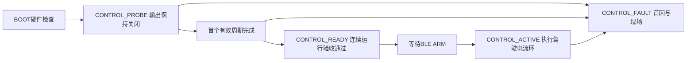

# 从BOOT到控制循环的运行诊断方案

状态：分阶段实施。串口首帧/首次平衡观察、运行故障报告、分段耗时与首轮时间基准已实现，见[当前串口说明](./serial_output_age_debug.md)。本页的CONTROL_READY连续验收门、独立阻塞观察、BOOT编号调整与详细BLE扩展仍是后续方案，未实现。

## 问题定义

BOOT_SUMMARY OK仍在ControlTask的for循环之前输出，随后allowControl。当前增加CONTROL_LOOP_ALIVE和CONTROL_BALANCE_ACTIVE提供首帧与首次平衡完成证据，运行期StopControl在禁能并停止定时器后打印完整故障。独立的CONTROL_READY连续运行验收门尚未实现。

保留BOOT_SUMMARY的含义：硬件/服务初始化成功；增加CONTROL_READY表示未驾驶状态下的周期链已经工作。串口负责把启动过程完整交接到CONTROL_READY，BLE负责之后的状态、事件和导出。驾驶电流环只有ARM后才执行，因此CONTROL_READY不能宣称电流闭环或车辆平衡已验证。

## 期望状态



串口参考输出如下，数值是示例，不是现有实测：

```text
BOOT_SUMMARY OK
CONTROL_PROBE BEGIN outputs=OFF
CONTROL_FIRST_FRAME OK seq=1 encoder=OK imu=OK outer=OK
CONTROL_READY cycles=2000 elapsed_ms=2000 outputs=OFF arm_allowed=1
```

失败示例：

```text
CONTROL_FAULT stage=ENCODER point=wheel_age code=ESP_ERR_TIMEOUT
  raw_domain=application raw=0 value_us=4310 threshold_us=4000
  cycle=1 notify_count=8 release_count=9 file=... line=...
CONTROL_SUMMARY FAIL
```

序号仅用于BOOT初始化项目。PROBE、READY、ACTIVE和FAULT使用固定名称；运行错误使用稳定ErrorPoint，不继续累加初始化编号。修正当前BootStep与ErrorPoint混用，BOOT项目与错误点分别输出。

## 最小实现顺序

1. **故障不能静默。** 扩充stopControl的记录，保留先禁能、锁存首因、保存现场的顺序。先在RAM中提交定长故障快照，低频上下文输出一次完整串口报告；在READY之后发生故障也保留这条可选串口输出，BLE订阅与否不影响故障记录。普通故障不写Flash、不主动panic。
2. **建立首次释放时间基准。** 把初始化说明日志放在周期定时器开始之前。首个真实通知用于建立时间基准或明确的首帧初始化，不以“刚打印完日志”当作上次采样时间。记录ulTaskNotifyTake返回计数，累计跳过的释放点；不逐条补算过期通知。控制dt、姿态dt和采样时间各自使用正确的上一有效时间。当前定时器提前启动导致通知积压是待实测假设，不当作已确认根因。
3. **在ARM之前验证循环。** 保持输出关闭，执行编码器、IMU、外环有效性和状态发布。建议初始验收窗口2秒并观测约2000轮，具体标准按实测预算确定；要求首帧完成、采样持续有效、没有致命故障，记录最大间隔、执行耗时和积压次数。仅“未超过10ms停机线”不等于满足1kHz目标，需同时检查释放丢失和1ms周期预算。通过后才设置run_allowed并发布CONTROL_READY；提前ARM拒绝，不延后执行。
4. **填补阻塞时的观察盲区。** 仅在ControlTask里加日志不能发现它卡在等待或I²C内的情况。建议复用尚未退出的app_main作为临时启动观察者，使用固定共享快照与有界等待，看到阶段变化便输出；不新增永久DiagnosticsTask。观察窗口从对齐完成且输出关闭之后开始，READY或FAIL后结束。若循环长期不推进，输出最后阶段、释放计数和周期计数并锁住ARM；不跨核调用电机清理、I²C或PWM操作。对齐本身的超时另按其既有硬件初始化边界处理。
5. **READY之后由BLE承接。** 继续保持最后有效快照、独立首故障、错误事件环。状态转换产生低频事件，不逐周期生成事件。扩展版本化DIAG只读包以提供CONTROL_READY/ACTIVE、最后阶段、循环计数、故障值/阈值和有效位；保留.003/.004线上契约与现有schema=1事件，不悄悄重解释现有字段。详细数据按需读取或分包，避免和20Hz驾驶命令争用。

## 应保留的定长现场

| 字段 | 用途 |
| --- | --- |
| release_count / enter_count / complete_count | 区分定时器不释放、任务未被调度、任务执行中失败 |
| stage / stage_started_us | 标出等待、禁能、编码器、IMU、外环、ADC、PI/PWM、发布所在阶段 |
| notify_count / skipped_releases | 识别首次积压与运行中漏周期 |
| cycle_dt_us / cycle_elapsed_us / 各阶段最大耗时 | 区分间隔异常与本轮执行超时；统一记录单位 |
| first_fault / fault_control / last_control | 保留原始首因、故障前有效状态与最近状态 |
| control_ready / active / sampled_us | 将“初始化通过”“循环就绪”“正在驾驶”“数据新鲜”分开 |

共享对象用现有短临界区保护；不能只加volatile就认为跨核一致。高频路径只写定长内存，不做格式化日志、BLE发送、动态分配或Flash写入。当前control_gap同时表示秒单位周期检查和微秒单位执行耗时检查，补齐时应统一单位或拆点，防止同一点value单位歧义。

## 验收与限制

- 软件注入首轮无通知、多个积压通知、首帧零间隔、编码器/IMU失败、ADC超时、FAULT发生在首帧之前、故障记录后的BLE重连。每种情况都应有明确结束状态，不能停留在仅BOOT OK。
- 未ARM的台架验证首先通过；出现故障先读取首因，不先改PI、降频或放宽过流/时效保护。
- ARM后的电流采样与PWM链需单独的受保护台架验证，测电流相序/极性、零偏、采样时效、1ms预算及Wi-Fi共存。CONTROL_READY不能替代这些验证。
- 串口断开后，页面须能读取首次故障、最近有效状态并导出；复位前导出RAM，panic后使用匹配ELF提取Flash dump。
- 启动观察者只解决READY之前的可见性。READY后的永久阻塞，需要另行评估既有看门狗的订阅、超时和安全禁能路径；不能声称BLE心跳观察或ControlTask内部StopControl能处理所有卡死。当前TASK_WDT_PANIC未开启，不保证每种卡死都会产生Core dump。
- 固件变化后执行完整IDF构建、内存/栈检查，再进行授权后的实板验证。已实现部分以当前串口说明为准，不把本页后续设计视为硬件验证结论。
